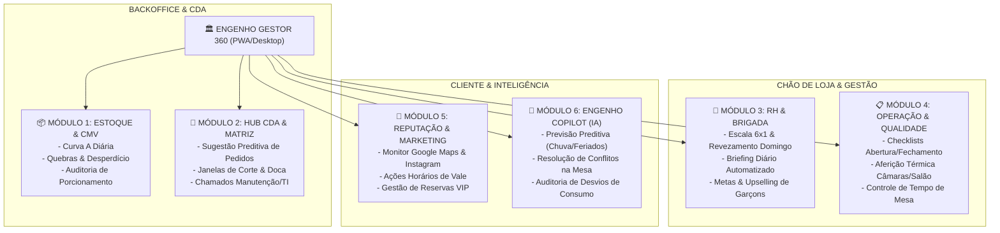

# 🏛️ Engenho Gestor 360 - Documentação Técnica & Operacional Enterprise
### Unidade: Restaurante Engenho Cozinha Brasileira – Shopping Ponta Negra (Manaus/AM)
**Grupo Engenho | Versão:** 1.0.0-PROD | **Ambiente:** Enterprise Architecture

---

## 🎯 Sumário Executivo
O **Engenho Gestor 360** é uma plataforma de gestão integrada (Web & PWA Mobile-First) desenvolvida para atuar como o **Cockpit de Comando do Gerente de Loja** do Restaurante Engenho – Shopping Ponta Negra.

A solução atende tanto às exigências da operação diária de chão de salão e cozinha de alto padrão, quanto à governança corporativa da holding **Grupo Engenho**, integrando estoque, controle de custos (CMV), cadeia de suprimentos via **CDA (Centro de Desenvolvimento, Distribuição e Administração)**, escala e conformidade de RH, qualidade e inspeções sanitárias, reputação de marca e inteligência preditiva via **IA Generativa (Gemini Copilot)**.

---

## 📚 Arquitetura de Documentação Enterprise (Índice Mestre)

A documentação do projeto está subdividida em especificações funcionais, técnicas, de dados e de processos na pasta [`docs/`](./docs/):

| Código | Documento | Finalidade & Escopo Técnico |
| :--- | :--- | :--- |
| **DOC-01** | [Diagnóstico do Grupo & Unidade Ponta Negra](./docs/01_DIAGNOSTICO_GRUPO_E_UNIDADE.md) | Dossiê corporativo, análise de público classe A/B, horários de pico, análise do cardápio e reputação digital. |
| **DOC-02** | [Arquitetura Funcional & Módulos do Sistema](./docs/02_ARQUITETURA_E_MODULOS.md) | Especificação detalhada de regras de negócio, fluxos BPMN, requisitos funcionais (RFs) e não funcionais (RNFs). |
| **DOC-03** | [Stack Tecnológica, Clean Architecture & Roadmap](./docs/03_ROADMAP_E_STACK_TECNICA.md) | Arquitetura técnica (Next.js 15, TypeScript, PWA, Tailwind, Supabase/PostgreSQL), CI/CD e cronograma de releases. |
| **DOC-04** | [Rotina Operacional & SLAs do Gerente](./docs/04_ROTINA_DO_GERENTE_PONTA_NEGRA.md) | Jornada cronológica do turno do gerente, cronogramas de pico, gatilhos de decisão e SLAs de salão/cozinha. |
| **DOC-05** | [Modelagem de Dados & DDL PostgreSQL](./docs/05_MODELAGEM_BANCO_DE_DADOS.md) | Schema relacional completo, tipos ENUM, triggers de CMV, constraints, índices e políticas de Row Level Security (RLS). |
| **DOC-06** | [Especificação de APIs & Contratos de Integração](./docs/06_ESPECIFICACAO_DE_APIS_E_CONTRATOS.md) | Contratos OpenAPI, DTOs de requisição/resposta, webhooks de integração CDA e mensageria WhatsApp. |
| **DOC-07** | [Engenharia de IA & Engenho Copilot](./docs/07_ENGENHARIA_DE_IA_COPILOT.md) | System Prompts corporativos, ferramentas de Function Calling, pipeline preditivo de demanda e matriz de respostas de reviews. |
| **DOC-08** | [Segurança, Autenticação & Matriz RBAC](./docs/08_SEGURANCA_PERFIS_RBAC.md) | Controle de acesso baseado em papéis (Gerente Geral, Subgerente, Chef, CDA), auditoria imutável e conformidade LGPD. |
| **DOC-09** | [Manual de Procedimentos Operacionais Padrão (POPs)](./docs/09_MANUAL_DE_POPS_OPERACIONAIS.md) | POPs operacionais: Recebimento na Doca do Shopping, Alinhamento de Boqueta, Gestão de Conflitos e Checklists Sanitários. |
| **DOC-10** | [Sistema de Metas & Bonificação do Gerente (R$ 2.000)](./docs/10_SISTEMA_DE_METAS_E_BONIFICACAO.md) | Cockpit financeiro pessoal: Alimentos (35%), NPS (25%) e Vendas (40%) para garantir 100% do bônus mensal. |
| **DOC-11** | [Guia Rápido de Uso do Aplicativo](./docs/11_GUIA_DE_USO_DO_APP.md) | Manual passo a passo para utilizar o app no celular, tablet e computador no dia a dia da loja. |
| **DOC-12** | [Benchmark Competitivo & Insights de UI/UX (Toast, 7shifts)](./docs/12_BENCHMARK_E_INSIGHTS_DE_UIX.md) | Estudo dos líderes mundiais: Lista 86, Floor Plan com tempo de boqueta, FAB de emergência e glanceable design. |
| **DOC-13** | [Sistema de Rastreabilidade Total & Conciliação com IA](./docs/13_RASTREABILIDADE_TOTAL_DE_INSUMOS.md) | Foto da NF, ciclo térmico freezer/geladeira, devolução com QR Code e conciliação matemática com PDV. |
| **DOC-14** | [Câmera Anti-Fraude & Bloqueio de Galeria](./docs/14_SISTEMA_ANTI_FRAUDE_E_CAMERA_RESTRITA.md) | Captura física obrigatória, detecção de foto de tela (moiré) por IA e cobrança no fechamento. |
| **DOC-15** | [Marketing Integrado a Validades & Engenharia de CMV](./docs/15_MARKETING_INTEGRADO_VALIDADE_E_CMV.md) | Promoções preditivas para insumos a vencer (ex: Chopp), combos de alto markup, cálculo de CMV e copies prontas. |
| **DOC-16** | [Estratégia de Marketing Viral de Alta Conversão](./docs/16_ESTRATEGIA_MARKETING_VIRAL_E_CONVERSAO.md) | Estudo de Manaus/Ponta Negra, gaps da concorrência, algoritmo do Instagram, roteiros cena a cena e storytelling humano. |
| **DOC-17** | [Gestão com Visão de Dono (Owner Mindset) & DRE Diário](./docs/17_GESTAO_COM_VISAO_DE_DONO_E_DRE.md) | DRE gerencial em tempo real, prevenção de perdas (cancelamentos/cortesias), saúde de ativos críticos e CRM VIP. |
| **DOC-18** | [UI/UX Design System Premium, Calm Tech & Navegação](./docs/18_UIX_DESIGN_SYSTEM_PREMIUM_E_INTUITIVO.md) | Filosofia calm technology, redução de carga cognitiva, tipografia Outfit/Plus Jakarta Sans e 5 pilares ergonômicos. |
| **DOC-19** | [Manual de Onboarding & Guia de Sucesso do Gerente](./docs/19_ONBOARDING_NOVO_GERENTE_PONTA_NEGRA.md) | Dossiê da unidade, rotina hora a hora, trilha dos 30 dias interativa e contatos de emergência/CDA. |
| **DOC-20** | [Apresentação Executiva & Pitch para a Diretoria](./docs/20_PITCH_EXECUTIVO_DIRETORIA_GRUPO_ENGENHO.md) | Dores da rede, ROI financeiro (+R$ 268k/ano por loja / +R$ 1,3M rede), diferenciais e roteiro de fala para sócios. |
| **DOC-21** | [Onboarding da Brigada & Ingestão de POPs por IA](./docs/21_ONBOARDING_COLABORADORES_E_IA_POPS.md) | Onboarding por função (Garçom, Grelha, Steward, Bar, Hostess) e OCR multimodal para converter POPs físicos em tarefas. |
| **DOC-22** | [Arquitetura de IA Multimodal & Token Economics](./docs/22_ARQUITETURA_IA_MULTIMODAL_E_TOKEN_ECONOMICS.md) | Gating em 5 camadas, economia de tokens (Context Caching, crop ROI, edge heuristics) e motor de decisões proativas. |
| **DOC-23** | [Matriz de Percalços Operacionais & Contornos](./docs/23_MANUAL_DE_PERCALCOS_E_CONTORNOS_OPERACIONAIS.md) | Protocolos de contingência: queda de internet (offline PWA), apagão, atraso CDA, fraude de NF, ANVISA surpresa e calor Manaus. |
| **DOC-24** | [Padrão Enterprise Nível AAA, Governança & Auditoria](./docs/24_PADRAO_ENTERPRISE_AAA_GOVERNANCA_E_AUDITORIA.md) | Trilha criptográfica imutável SHA-256, segurança Kiosk com PIN, dossiê pericial ANVISA e simulador What-If P&L. |
| **DOC-25** | [Cardápio Oficial, Fichas Técnicas & Matriz de Insumos](./docs/25_CARDAPIO_OFICIAL_FICHAS_TECNICAS_E_INSUMOS.md) | Engenharia de cardápio, fichas técnicas completas com sub-insumos, gramaturas, fornecedores (CDA/Panair) e CMVs. |

---

## 🏛️ Matriz de Módulos Corporativos

---

## 🎖️ KPIs & Métricas-Chave de Sucesso Gerencial (SLAs de Loja)

| Indicador | Meta Enterprise | Modo de Aferição no App |
| :--- | :--- | :--- |
| **CMV Real da Loja (Custo de Mercadoria)** | Entre 28% e 32% | Cálculo diário via confronto de saídas físicas Curva A vs. Vendas PDV. |
| **Taxa de Ruptura de Cardápio em Picos** | 0% nos itens carro-chefe | Alerta de estoque de segurança integrado ao prazo de entrega do CDA. |
| **Tempo Médio de Saída de Pratos (Almoço)** | $\le$ 22 minutos | Monitoramento de tempo de boqueta via checklist operacional. |
| **Tempo Médio de Saída de Pratos (Jantar/FDS)**| $\le$ 32 minutos | Acompanhamento de tempo de mesa e fila de espera. |
| **Acurácia de Inventário Curva A** | $\ge$ 98% | Auditoria diária de 20 itens de maior valor agregado. |
| **Índice de Resposta a Avaliações Google** | 100% respondidas em < 12h | Respostas geradas por IA e aprovadas pelo gerente em 1 toque. |
| **Conformidade de Escala & Folgas (CLT)** | 100% de conformidade legal | Bloqueio sistêmico de escalas irregulares ou violação de domingos. |

---

## 💻 Guia de Inicialização e Desenvolvimento

O código-fonte da aplicação seguirá a estrutura monorepo/modular descrita em [`DOC-03`](./docs/03_ROADMAP_E_STACK_TECNICA.md).
Consulte os documentos individuais para especificações de código, schemas de banco e regras de negócio antes de implementar novos recursos.
