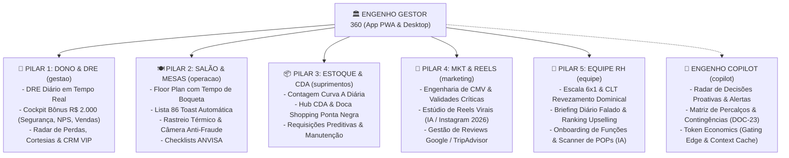

# 🏗️ DOC-02: Arquitetura Funcional, Módulos & Engenharia de Requisitos
### Engenho Gestor 360 – Especificação Funcional Enterprise

O **Engenho Gestor 360** é o sistema operacional de gestão diária do **Gerente da Loja** do Restaurante Engenho (Shopping Ponta Negra – Manaus/AM), rodando de forma híbrida (PWA Mobile-First no smartphone durante a circulação pelo salão e cozinha, e Desktop/Tablet no escritório da loja).

---

## 📱 Visão dos 5 Pilares Ergonômicos de Gestão (+ Engenho Copilot IA)

Para garantir operação com 1 única mão no chão de loja barulhento sem sobrecarga cognitiva (padrão *Calm Technology*), a arquitetura funcional consolida os módulos do restaurante em **5 Pilares Ergonômicos Principais** complementados pelo **Engenho Copilot Multimodal**:

---

## 📦 Módulo 1: Estoque & CMV da Loja (Prevenção de Perdas)
Focado no controle ágil do chão de loja, sem burocracia excessiva, priorizando a **Curva A de alto valor financeiro**.

### Funcionalidades Detalhadas:
1. **Contagem Rápida Diária Curva A (Top 20 Itens Nobres):**
   * Carnes nobres (Picanha, Filé Mignon, Carne de Sol Artesanal).
   * Peixes regionais e frutos do mar (Lombo de Tambaqui, Pirarucu fresco, Camarão GG/médio).
   * Queijos (Coalho, Catupiry) e Bacalhau importado pelo CDA.
   * Bebidas de alto valor (Garrafas de Whisky 12/18 anos, Gin premium, Vinhos nobres da adega).
2. **Registro Instantâneo de Desperdício/Quebras:**
   * Lançamento em 3 cliques: *Item*, *Quantidade/Kg* e *Motivo* (Passou do ponto na grelha, Validade vencida, Erro de anotação do garçom, Quebra física de louça/garrafa).
   * Foto anexada como evidência para auditoria.
3. **Semáforo de Estoque Crítico:**
   * 🟢 Verde: Suficiente para cobrir até a próxima entrega do CDA.
   * 🟡 Amarelo: Ponto de atenção (restam menos de 2 turnos de pico).
   * 🔴 Vermelho: Risco iminente de ruptura (acionar reposição de emergência ou orientar garçons para suspender prato).
4. **Calculadora de CMV Teórico vs. Real:**
   * Confronto diário entre o que foi baixado pelo sistema de vendas e o estoque físico real apurado pelo gerente.

---

## 🚚 Módulo 2: Hub CDA & Chamados Corporativos da Matriz
O canal definitivo de comunicação e suprimentos entre a loja da Ponta Negra e a holding do Grupo Engenho.

### Funcionalidades Detalhadas:
1. **Gerador Preditivo de Pedidos para o CDA (Regra dos Últimos Meses + 10%):**
   * O algoritmo analisa o histórico real de vendas dos **últimos 3 meses (12 semanas)** para apurar a **média semanal de consumo** de cada insumo.
   * **Margem de Segurança Obrigatória (+10%):** Adiciona sempre **10% a mais** sobre a média semanal para blindar a loja contra rupturas no fim de semana (feijoada de sábado e almoço de domingo de famílias no Shopping Ponta Negra).
   * **Fórmula Homologada:**
     $$\text{Demanda Projetada} = (\text{Média Semanal dos Últimos 3 Meses}) \times 1{,}10$$
     $$\text{Pedido Sugerido} = \text{Lote Mínimo}\left[\max(0, \text{Demanda Projetada} - \text{Estoque em Loja})\right]$$
   * Evita erros humanos comuns de esquecer insumos secundários vitais (ex: farinha do Uarini, jambu fresco, tucupi, embalagens to-go, camarão GG e bebidas de alto valor).
2. **Controle de Horários de Corte do CDA:**
   * Notificação push no celular do gerente: *"Atenção: Horário de corte do pedido do CDA encerra às 15:00 de hoje para entrega de quinta-feira!"*
3. **Checklist Digital de Recebimento na Doca (Shopping Ponta Negra):**
   * Conferência de itens recebidos vs. pedido emitido.
   * Registro obrigatório de conformidade técnica:
     * Temperatura do caminhão refrigerado e dos pescados/carnes no descarregamento ($\le -18^\circ\text{C}$ congelados, $\le +4^\circ\text{C}$ resfriados).
     * Integridade dos lacres e das caixas.
     * Registro de avarias com foto imediata para glosa automática na nota fiscal.
4. **Central de Chamados com Setores Corporativos:**
   * **Manutenção Predial:** Abertura de chamados prioritários (câmara fria oscilando, ar-condicionado do salão, exaustor, fogão).
   * **TI / Sistemas:** Falha em impressoras de boqueta, instabilidade de rede ou PDV.
   * **Financeiro:** Prestação de contas de pequenas despesas de caixa e envio de comprovantes.
   * **RH Corporativo:** Solicitação de abertura de vagas e envio de documentações de admissão/demissão.

---

## 👥 Módulo 3: RH de Loja, Escalas & Briefing de Equipe
Voltado para liderança, clima organizacional e produtividade da brigada de salão e cozinha.

### Funcionalidades Detalhadas:
1. **Quadro de Escalas 6x1 & Revezamento de Domingos:**
   * Visualização de quem está de plantão, folga ou férias no turno da manhã (10h às 18h) e turno da noite (16h às 00h).
   * Controle automatizado de cumprimento da folga semanal e do domingo legal (CLT).
2. **Controle de Absenteísmo (Faltas e Atrasos):**
   * Registro de atestados médicos com foto e histórico individual do colaborador.
   * Painel de substituições rápidas (remanejamento de folguista ou hora extra alinhada).
3. **Gerador de Briefing Diário Pré-Turno (Almoço e Jantar):**
   * Roteiro de 5 minutos gerado pelo Copilot IA e exibido no celular do gerente antes de reunir a equipe:
     * **Meta financeira do turno** (ex: R$ 18.000 no almoço de domingo).
     * **Prato Foco de Venda:** Itens com margem alta ou estoque alto que precisa girar.
     * **Avisos de Ruptura:** Pratos que a cozinha está racionando ou sem insumo.
     * **Reservas VIP:** Nomes de clientes especiais ou aniversariantes com mesa reservada.
     * **Pílula de Excelência:** Lembrete de padrão (ex: servir pela direita, apresentação de sobremesas à mesa, cordialidade).
4. **Ranking de Desempenho e Vendas Adicionais:**
   * Acompanhamento por garçom: venda de vinhos, sobremesas, entradas e cafés (estratégia de aumento de ticket médio).

---

## 📋 Módulo 4: Checklists Operacionais & Salão Ponta Negra
Garante o padrão de loja impecável exigido pelo público nobre do shopping.

### Funcionalidades Detalhadas:
1. **Checklist de Abertura (Concluir até 11:15):**
   * **Salão:** Climatização ligada e termostato aferido, som ambiente na playlist corporativa do Engenho, iluminação cenográfica ajustada, mesas alinhadas com mise en place completo, cardápios higienizados.
   * **Bar:** Estoque de gelo limpo, chopeira com pressão e temperatura calibrada, taças polidas.
   * **Cozinha:** Termômetro das câmaras frias aferido, gás aberto e testado, pré-preparo (mise en place) dos peixes e carnes concluído.
   * **Sanitários:** Inspeção visual de limpeza, abastecimento de sabonete e toalhas de papel.
2. **Checklist de Troca de Turno (16h30):**
   * Reposição de louças e talheres, limpeza de chão de salão, transferência de informações críticas do turno do almoço para o turno do jantar.
3. **Checklist de Fechamento (Após as 23h):**
   * Travamento de câmaras frigoríficas e adega com chave física/senha.
   * Desligamento total de fritadeiras, fornos e registro geral de gás.
   * Coleta de lixo e descarte correto.
   * Fechamento de gaveta de caixa e lacre do cofre.

---

## 📈 Módulo 5: Marketing Local & Gestão de Reputação
Fortalecimento da marca no Shopping Ponta Negra e fidelização do público local.

### Funcionalidades Detalhadas:
1. **Monitor de Avaliações (Google Maps, TripAdvisor e Instagram):**
   * Centraliza avaliações novas recebidas pela unidade Ponta Negra.
   * Classificação automática por sentimento (Positivo, Neutro, Reclamação).
2. **Gerador de Respostas com IA:**
   * Cria respostas empáticas e profissionais em segundos para o gerente postar no Google Maps (agradecendo elogios ou acolhendo reclamações com convite para retorno).
3. **Plano de Ocupação para Horários de Vale:**
   * Ações táticas para as tardes de terça a quinta (ex: Festival da Tarde com tapiocas e cafés gourmet, combos executivos corporativos).
4. **Calendário de Eventos de Manaus:**
   * Alertas de datas chave com antecedência para reforço de estoque e equipe:
     * Feriados locais (Aniversário de Manaus 24/Out, Elevação do Amazonas 05/Set).
     * Finais de semana do Festival de Parintins (grande fluxo de turistas de passagem).
     * Dias das Mães, Pais e Namorados (picos históricos de faturamento).

---

## 🤖 Módulo 6: Engenho Copilot (Inteligência Artificial Integrada)
O assistente virtual executivo que apoia as decisões do gerente 24 horas por dia.

### Funcionalidades Detalhadas:
1. **Previsão Preditiva de Demanda:**
   * Cruza histórico de vendas + dia da semana + previsão meteorológica de Manaus (dias de chuva aumentam o fluxo de shopping) para prever faturamento e número de coberturas.
2. **Consultor de Resolução de Conflitos:**
   * O gerente descreve: *"Mesa 14 reclamou que o tambaqui demorou 45 minutos e a carne veio fria. Como agir?"*
   * A IA gera na hora o script de abordagem à mesa: postura de escuta ativa, oferta de cortesia elegante (sobremesa/café ou estorno parcial) e procedimento para alinhamento imediato com o chef de cozinha.
3. **Auditor de Anomalias de Consumo:**
   * Alertas proativos: *"Atenção: Nesta semana o consumo de camarão GG foi 28% superior ao registrado nas vendas de pratos com camarão. Verifique possíveis porcionamentos descalibrados na cozinha ou perdas não registradas."*
4. **Redator de Comunicados Internos:**
   * Criação automática de mensagens elegantes para o grupo da equipe no WhatsApp (anúncio da escala semanal, parabenização por recorde de faturamento, reforço de pontualidade).

---

## 📋 Matriz de Requisitos Funcionais (RFs)

| Código | Módulo | Requisito Funcional | Prioridade |
| :--- | :--- | :--- | :---: |
| **RF-001** | Estoque | O sistema deve listar diariamente os 20 itens da Curva A com campos de contagem rápida e cálculo instantâneo de divergência física vs sistema. | P0 |
| **RF-002** | Estoque | O sistema deve permitir o registro de perdas/quebras com seleção de motivo pré-definido e upload obrigatório de foto quando valor > R$ 50. | P0 |
| **RF-003** | Estoque | O sistema deve exibir semáforo de status (Verde, Amarelo, Vermelho) para cada insumo com base no consumo médio por turno. | P0 |
| **RF-004** | Estoque | O sistema deve calcular o CMV Teórico e Real comparando consumo físico com as vendas registradas no PDV. | P1 |
| **RF-005** | CDA | O sistema deve calcular sugestão de pedido para o CDA com base em vendas passadas, estoque de segurança e projeção de fim de semana. | P0 |
| **RF-006** | CDA | O sistema deve emitir alertas sonoros e visuais 2 horas antes do encerramento da janela de corte de pedidos do CDA. | P0 |
| **RF-007** | CDA | O sistema deve fornecer checklist de conferência de doca com registro obrigatório da temperatura do caminhão baú refrigerado. | P0 |
| **RF-008** | CDA | O sistema deve permitir a geração de guias de divergência e glosa de faturamento em caso de insumo avariado ou faltante no recebimento. | P1 |
| **RF-009** | Matriz | O sistema deve disponibilizar abertura de chamados categorizados (Manutenção, TI, RH, Financeiro) com SLA de atendimento. | P1 |
| **RF-010** | RH | O sistema deve gerenciar escala 6x1 com validação automática de folga semanal e intervalo de descanso legal (CLT). | P0 |
| **RF-011** | RH | O sistema deve registrar faltas, atrasos e anexar atestados médicos com histórico acumulado por colaborador. | P1 |
| **RF-012** | RH | O sistema deve gerar briefing diário de 5 minutos com base na meta financeira, prato foco e alertas de estoque do turno. | P0 |
| **RF-013** | RH | O sistema deve ranquear os garçons por índice de upselling (venda de sobremesas, entradas, cafés e vinhos). | P2 |
| **RF-014** | Operação | O sistema deve exigir checklist digital de abertura com bloqueio de encerramento caso itens críticos não estejam conformes. | P0 |
| **RF-015** | Operação | O sistema deve conter checklist de fechamento com conferência obrigatória de válvulas de gás e tranca de câmaras/adega. | P0 |
| **RF-016** | Operação | O sistema deve registrar aferição de temperaturas das câmaras frias 2x ao dia com histórico para fiscalização sanitária. | P0 |
| **RF-017** | Reputação| O sistema deve capturar e classificar avaliações do Google Maps e TripAdvisor por sentimento (Positivo, Neutro, Negativo). | P1 |
| **RF-018** | Reputação| O sistema deve gerar respostas personalizadas com IA para aprovação do gerente em 1 toque antes da publicação. | P1 |
| **RF-019** | Marketing| O sistema deve disponibilizar calendário de eventos regionais de Manaus com recomendações de preparação operacional. | P2 |
| **RF-020** | Copilot | O sistema deve permitir ao gerente interagir por chat com a IA para esclarecer dúvidas operacionais e obter scripts de atendimento. | P0 |
| **RF-021** | Copilot | O sistema deve cruzar previsão meteorológica de Manaus com histórico de vendas para prever demanda do Shopping Ponta Negra. | P1 |
| **RF-022** | Copilot | O sistema deve emitir alertas proativos de desvio de consumo de insumos nobres (ex: porcionamento incorreto de camarão). | P1 |
| **RF-023** | Segurança| O sistema deve implementar controle de acesso RBAC com perfis distintos (Gerente, Subgerente, Chef, Estoquista, Matriz). | P0 |
| **RF-024** | Auditoria| O sistema deve registrar trilha de auditoria imutável para todas as alterações de estoque, cancelamentos e aprovações de perdas. | P0 |

---

## ⚙️ Matriz de Requisitos Não Funcionais (RNFs)

| Código | Categoria | Especificação Técnica do Requisito |
| :--- | :--- | :--- |
| **RNF-001** | **Performance** | Tempo de resposta de transações de tela $\le 1.2$ segundos em rede móvel 4G/5G. |
| **RNF-002** | **Disponibilidade** | Disponibilidade de serviço $\ge 99.8\%$ durante o horário operacional (10h às 00h). |
| **RNF-003** | **Offline-First** | O app deve permitir preenchimento de contagens e checklists em áreas de sombra de sinal (ex: câmara fria ou subsolo), sincronizando via IndexedDB quando reconectar. |
| **RNF-004** | **Segurança** | Criptografia ponta a ponta com TLS 1.3 em trânsito e AES-256 em repouso no banco de dados. |
| **RNF-005** | **Usabilidade (UX)** | Design Mobile-First com suporte a Dark Mode ergonômico para ambientes com iluminação indireta (salão à noite). |
| **RNF-006** | **Conformidade LGPD**| Anonimização de dados médicos e conformidade com a Lei Geral de Proteção de Dados (Lei nº 13.709/2018). |
| **RNF-007** | **Auditabilidade** | Logs de auditoria devem ser preservados por no mínimo 5 anos para fins fiscais e corporativos. |
| **RNF-008** | **Tolerância a Falhas**| Backup incremental automático a cada 60 minutos e RTO (Recovery Time Objective) $\le 30$ minutos. |
