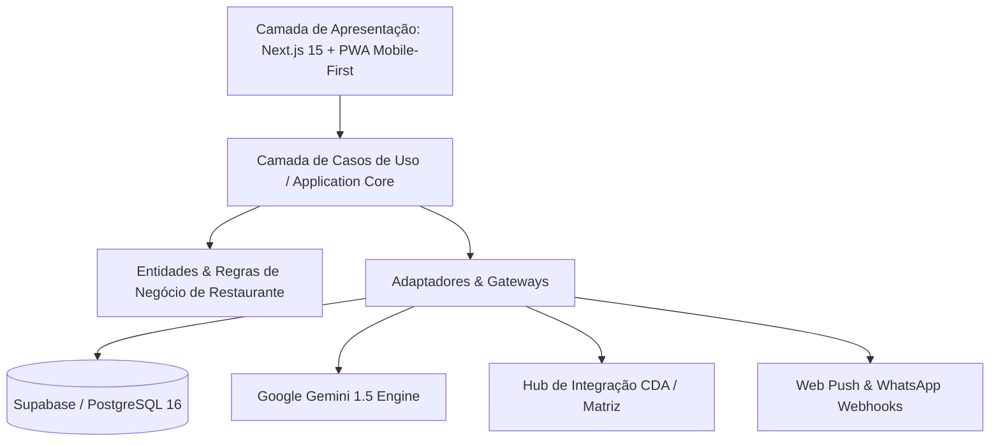
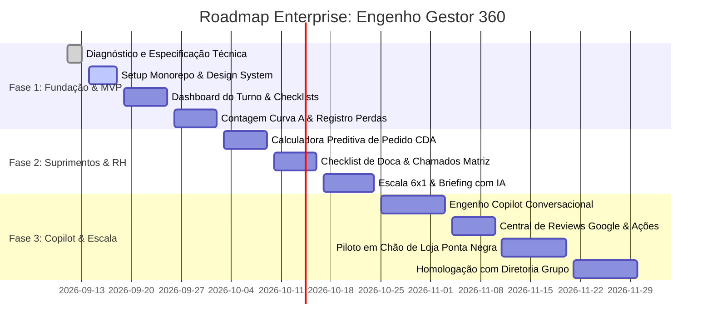

# 🛠️ DOC-03: Stack Tecnológica, Clean Architecture & Roadmap
### Engenho Gestor 360 – Especificação Técnica & Engenharia de Software Enterprise

---

## 1. Princípios de Arquitetura de Software
Como o gerente passa a maior parte do turno circulando pelo salão e pelas praças da cozinha, o app deve ser prioritariamente **Mobile-First**, ultra-rápido, tolerante a falhas de conectividade (Offline-First) e com separação clara de responsabilidades seguindo os princípios de **Clean Architecture & Feature-Driven Design**.



---

## 2. Stack Tecnológica Corporativa Homologada

| Camada | Tecnologia Homologada | Versão | Justificativa Técnica |
| :--- | :--- | :---: | :--- |
| **Framework Fullstack** | **Next.js (App Router)** | `15.x` | Server Components, rotas seguras e excelente suporte a Server Actions. |
| **Linguagem Base** | **TypeScript** | `5.5+` | Tipagem estática estrita (`strict: true`) para prevenção de bugs em tempo de compilação. |
| **Estilização & Design** | **Tailwind CSS + shadcn/ui** | `v4 / Radix` | Estética contemporânea, responsividade cirúrgica, temas Claro/Escuro sob medida. |
| **Ícones & Microinterações**| **Lucide React + Framer Motion** | `latest` | Feedback tátil e visual de app nativo no iPhone e Android. |
| **PWA & Offline-First** | **Serwist (Workbox Next)** | `latest` | Gerenciamento de Service Workers, cache de rotas e sincronização em segundo plano. |
| **Banco de Dados & Auth** | **Supabase (PostgreSQL 16)** | `latest` | Autenticação RBAC, Row Level Security nativo e triggers em tempo real. |
| **Gerenciamento de Estado** | **Zustand + TanStack Query v5** | `latest` | Cache de dados assíncronos, revalidação automática e persistência offline (IndexedDB). |
| **Validação de Schemas** | **Zod** | `3.x` | Validação de DTOs e formulários tanto no cliente quanto na API. |
| **Motor de IA** | **@google/genai (Gemini SDK)**| `latest` | Integração de alto desempenho com Function Calling e baixa latência. |
| **Testes Automatizados** | **Vitest + Playwright** | `latest` | Testes unitários para regras de cálculo de CMV e testes E2E para fluxos de checkout e dock receipt. |

---

## 3. Estrutura de Pastas Enterprise (Next.js 15 App Router)

```
d:/Gestão Engenho/
├── apps/
│   └── web/
│       ├── public/
│       │   ├── icons/             # Ícones do PWA (192x192, 512x512)
│       │   ├── manifest.json      # Configuração de instalação PWA
│       │   └── sw.js              # Service Worker registrado
│       │
│       ├── src/
│       │   ├── app/               # Next.js App Router
│       │   │   ├── (auth)/        # Rota de Login e Quick PIN
│       │   │   │   ├── login/
│       │   │   │   └── pin-access/
│       │   │   ├── (dashboard)/   # Rotas autenticadas do Gerente
│       │   │   │   ├── layout.tsx # Layout com Bottom Navigation bar
│       │   │   │   ├── page.tsx   # Dashboard Principal do Turno
│       │   │   │   ├── estoque/   # Curva A, Perdas e Quebras
│       │   │   │   ├── cda/       # Pedidos, Doca e Chamados Corporativos
│       │   │   │   ├── rh/        # Escalas 6x1, Faltas e Briefing Diário
│       │   │   │   ├── operacao/  # Checklists de Abertura/Fechamento
│       │   │   │   ├── marketing/ # Reviews Google Maps e Eventos
│       │   │   │   └── copilot/   # Interface conversacional da IA
│       │   │   └── api/           # Endpoints Backend RESTful
│       │   │
│       │   ├── components/        # Componentes reutilizáveis
│       │   │   ├── ui/            # Primitivos shadcn/ui (Button, Dialog, etc.)
│       │   │   ├── layout/        # BottomNav, TopHeader, OfflineBanner
│       │   │   └── shared/        # CameraCapture, TemperatureGauge, StatusBadge
│       │   │
│       │   ├── features/          # Módulos verticais de negócio
│       │   │   ├── inventory/     # Hooks, services e tipos de estoque
│       │   │   ├── cda/           # Cálculos de pedidos e protocolo de doca
│       │   │   ├── human-resources/ # Algoritmo de escala e briefing
│       │   │   ├── checklists/    # Mecanismo de auditoria e fotos
│       │   │   └── ai-copilot/    # Integração com Gemini e Tool Calling
│       │   │
│       │   ├── lib/               # Clientes e utilitários
│       │   │   ├── supabase/      # Cliente Supabase tipado
│       │   │   ├── gemini/        # Cliente Google GenAI
│       │   │   └── db/            # Conexão direta Drizzle/Prisma se aplicável
│       │   │
│       │   └── types/             # Tipos TypeScript globais e contratos
│       │
│       ├── tailwind.config.ts
│       ├── tsconfig.json
│       └── package.json
│
├── docs/                          # Documentação técnica e operacional
└── .github/
    └── workflows/
        └── ci-cd.yml              # Pipeline automatizado de lint, build e teste
```

---

## 4. Pipeline de Integração e Entrega Contínua (CI/CD)

```yaml
# .github/workflows/ci-cd.yml
name: Engenho Gestor 360 - CI/CD Pipeline

on:
  push:
    branches: [main, develop]
  pull_request:
    branches: [main]

jobs:
  quality-gate:
    runs-on: ubuntu-latest
    steps:
      - uses: actions/checkout@v4
      - uses: actions/setup-node@v4
        with:
          node-version: 20
          cache: 'npm'

      - name: Instalar Dependências
        run: npm ci

      - name: Verificação de Tipos TypeScript
        run: npm run typecheck

      - name: Análise Estática de Código (ESLint)
        run: npm run lint

      - name: Execução de Testes Unitários & Lógica de CMV (Vitest)
        run: npm run test:run

      - name: Build de Produção & Validação PWA
        run: npm run build
```

---

## 5. Cronograma de Engenharia & Roadmap de Releases


