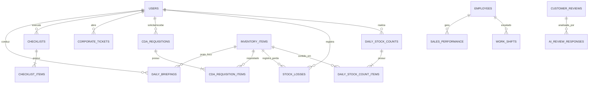

# 🗄️ DOC-05: Modelagem de Banco de Dados Relacional & DDL PostgreSQL
### Engenho Gestor 360 – Padrão Enterprise PostgreSQL 16+

---

## 1. Diagrama Entidade-Relacionamento (ERD)



---

## 2. Tipos Customizados (ENUMs)

```sql
-- Criação de tipos enumerados para integridade e validação em tempo de banco
CREATE TYPE user_role_enum AS ENUM (
    'GERENTE_GERAL',
    'SUBGERENTE',
    'CHEF_COZINHA',
    'SOUS_CHEF',
    'CHEFE_BAR',
    'ESTOQUISTA_RECEBIMENTO',
    'AUDITOR_MATRIZ_CDA'
);

CREATE TYPE item_category_enum AS ENUM (
    'CARNES_NOBRES',
    'PESCADOS_REGIONAIS',
    'FRUTOS_DO_MAR',
    'QUEIJOS_LATICINIOS',
    'BEBIDAS_DESTILADOS',
    'BEBIDAS_VINHOS',
    'SECOS_ESPECIARIAS',
    'HORTIFRUTI_REGIONAL',
    'DESCARTAVEIS_EMBALAGENS',
    'HIGIENE_LIMPEZA'
);

CREATE TYPE unit_measure_enum AS ENUM ('KG', 'GR', 'LT', 'ML', 'UN', 'CX', 'PCT', 'GF');

CREATE TYPE requisition_status_enum AS ENUM (
    'RASCUNHO',
    'ENVIADO_CDA',
    'EM_SEPARACAO',
    'EM_TRANSITO',
    'RECEBIDO_TOTAL',
    'RECEBIDO_COM_DIVERGENCIA',
    'CANCELADO'
);

CREATE TYPE loss_reason_enum AS ENUM (
    'VALIDADE_VENCIDA',
    'ERRO_PONTO_PREPARO',
    'ERRO_PEDIDO_SALAO',
    'CONTAMINACAO_AVARIA',
    'QUEBRA_FISICA',
    'TESTE_TREINAMENTO'
);

CREATE TYPE shift_type_enum AS ENUM ('MANHA_ALMOCO', 'NOITE_JANTAR', 'INTERMEDIARIO', 'FOLGA');

CREATE TYPE ticket_category_enum AS ENUM (
    'MANUTENCAO_CAMARA_FRIA',
    'MANUTENCAO_AR_CONDICIONADO',
    'MANUTENCAO_COZINHA_GAS',
    'TI_PDV_SISTEMAS',
    'RH_RECRUTAMENTO_PESSOAL',
    'FINANCEIRO_COMPRAS_EMERGENCIAS',
    'LOGISTICA_CDA'
);

CREATE TYPE ticket_priority_enum AS ENUM ('BAIXA', 'MEDIA', 'ALTA', 'CRITICA_OPERACAO_PARADA');
CREATE TYPE checklist_type_enum AS ENUM ('ABERTURA_SALAO', 'ABERTURA_COZINHA', 'TROCA_TURNO', 'FECHAMENTO_NOTURNO');
```

---

## 3. Scripts DDL: Estrutura Completa de Tabelas

```sql
-- Habilita UUIDv4 nativo
CREATE EXTENSION IF NOT EXISTS "uuid-ossp";

-- ============================================================================
-- 1. TABELA DE USUÁRIOS & CONTROLE DE ACESSO
-- ============================================================================
CREATE TABLE users (
    id UUID PRIMARY KEY DEFAULT uuid_generate_v4(),
    full_name VARCHAR(150) NOT NULL,
    email VARCHAR(150) UNIQUE NOT NULL,
    password_hash VARCHAR(255) NOT NULL,
    role user_role_enum NOT NULL DEFAULT 'SUBGERENTE',
    phone VARCHAR(20),
    pin_quick_access VARCHAR(6), -- PIN de 6 dígitos para login rápido no tablet
    is_active BOOLEAN NOT NULL DEFAULT TRUE,
    created_at TIMESTAMP WITH TIME ZONE DEFAULT CURRENT_TIMESTAMP,
    updated_at TIMESTAMP WITH TIME ZONE DEFAULT CURRENT_TIMESTAMP
);

-- ============================================================================
-- 2. CADASTRO DE PRODUTOS & MATRIZ DE ESTOQUE
-- ============================================================================
CREATE TABLE inventory_items (
    id UUID PRIMARY KEY DEFAULT uuid_generate_v4(),
    cda_code VARCHAR(50) UNIQUE NOT NULL, -- Código de identificação oficial no CDA
    name VARCHAR(150) NOT NULL,
    category item_category_enum NOT NULL,
    unit unit_measure_enum NOT NULL,
    min_stock_safe NUMERIC(10, 3) NOT NULL DEFAULT 0.000, -- Estoque de segurança
    ideal_stock NUMERIC(10, 3) NOT NULL DEFAULT 0.000,
    current_physical_stock NUMERIC(10, 3) NOT NULL DEFAULT 0.000,
    unit_cost NUMERIC(10, 2) NOT NULL DEFAULT 0.00, -- Custo unitário de transferência do CDA
    is_curve_a BOOLEAN NOT NULL DEFAULT FALSE, -- Flag para auditoria diária
    requires_cold_chain BOOLEAN NOT NULL DEFAULT FALSE, -- Exige cadeia fria (< -18°C ou 0 a 4°C)
    created_at TIMESTAMP WITH TIME ZONE DEFAULT CURRENT_TIMESTAMP,
    updated_at TIMESTAMP WITH TIME ZONE DEFAULT CURRENT_TIMESTAMP
);

CREATE INDEX idx_inventory_curve_a ON inventory_items(is_curve_a) WHERE is_curve_a IS TRUE;
CREATE INDEX idx_inventory_category ON inventory_items(category);

-- ============================================================================
-- 3. AUDITORIAS DIÁRIAS DE ESTOQUE (CONTAGEM CURVA A)
-- ============================================================================
CREATE TABLE daily_stock_counts (
    id UUID PRIMARY KEY DEFAULT uuid_generate_v4(),
    count_date DATE NOT NULL DEFAULT CURRENT_DATE,
    shift shift_type_enum NOT NULL,
    counted_by_user_id UUID NOT NULL REFERENCES users(id),
    status VARCHAR(20) NOT NULL DEFAULT 'CONCLUIDO',
    total_divergence_value NUMERIC(10, 2) DEFAULT 0.00,
    notes TEXT,
    created_at TIMESTAMP WITH TIME ZONE DEFAULT CURRENT_TIMESTAMP
);

CREATE TABLE daily_stock_count_items (
    id UUID PRIMARY KEY DEFAULT uuid_generate_v4(),
    count_id UUID NOT NULL REFERENCES daily_stock_counts(id) ON DELETE CASCADE,
    item_id UUID NOT NULL REFERENCES inventory_items(id),
    physical_quantity NUMERIC(10, 3) NOT NULL,
    system_quantity NUMERIC(10, 3) NOT NULL,
    divergence_quantity NUMERIC(10, 3) GENERATED ALWAYS AS (physical_quantity - system_quantity) STORED,
    divergence_value NUMERIC(10, 2) NOT NULL,
    reason_notes TEXT
);

-- ============================================================================
-- 4. REGISTRO DE QUEBRAS & PERDAS OPERACIONAIS
-- ============================================================================
CREATE TABLE stock_losses (
    id UUID PRIMARY KEY DEFAULT uuid_generate_v4(),
    item_id UUID NOT NULL REFERENCES inventory_items(id),
    quantity NUMERIC(10, 3) NOT NULL CHECK (quantity > 0),
    unit_cost_snapshot NUMERIC(10, 2) NOT NULL,
    total_loss_value NUMERIC(10, 2) GENERATED ALWAYS AS (quantity * unit_cost_snapshot) STORED,
    reason loss_reason_enum NOT NULL,
    photo_evidence_url VARCHAR(500),
    notes TEXT,
    reported_by_user_id UUID NOT NULL REFERENCES users(id),
    created_at TIMESTAMP WITH TIME ZONE DEFAULT CURRENT_TIMESTAMP
);

-- ============================================================================
-- 5. REQUISIÇÕES AO CDA (CENTRO DE DISTRIBUIÇÃO E ADMINISTRAÇÃO)
-- ============================================================================
CREATE TABLE cda_requisitions (
    id UUID PRIMARY KEY DEFAULT uuid_generate_v4(),
    requisition_number VARCHAR(30) UNIQUE NOT NULL,
    status requisition_status_enum NOT NULL DEFAULT 'RASCUNHO',
    order_date TIMESTAMP WITH TIME ZONE DEFAULT CURRENT_TIMESTAMP,
    expected_delivery_date DATE NOT NULL,
    delivered_at TIMESTAMP WITH TIME ZONE,
    requested_by_user_id UUID NOT NULL REFERENCES users(id),
    received_by_user_id UUID REFERENCES users(id),
    total_estimated_cost NUMERIC(12, 2) NOT NULL DEFAULT 0.00,
    dock_temperature_celsius NUMERIC(4, 1), -- Temperatura do caminhão no recebimento
    cda_invoice_number VARCHAR(50),
    notes TEXT,
    created_at TIMESTAMP WITH TIME ZONE DEFAULT CURRENT_TIMESTAMP,
    updated_at TIMESTAMP WITH TIME ZONE DEFAULT CURRENT_TIMESTAMP
);

CREATE TABLE cda_requisition_items (
    id UUID PRIMARY KEY DEFAULT uuid_generate_v4(),
    requisition_id UUID NOT NULL REFERENCES cda_requisitions(id) ON DELETE CASCADE,
    item_id UUID NOT NULL REFERENCES inventory_items(id),
    requested_quantity NUMERIC(10, 3) NOT NULL CHECK (requested_quantity > 0),
    delivered_quantity NUMERIC(10, 3) DEFAULT NULL,
    unit_cost_estimated NUMERIC(10, 2) NOT NULL,
    has_divergence BOOLEAN DEFAULT FALSE,
    divergence_reason TEXT
);

-- ============================================================================
-- 6. CHAMADOS CORPORATIVOS COM A MATRIZ
-- ============================================================================
CREATE TABLE corporate_tickets (
    id UUID PRIMARY KEY DEFAULT uuid_generate_v4(),
    ticket_number VARCHAR(30) UNIQUE NOT NULL,
    category ticket_category_enum NOT NULL,
    priority ticket_priority_enum NOT NULL DEFAULT 'MEDIA',
    title VARCHAR(200) NOT NULL,
    description TEXT NOT NULL,
    photo_evidence_url VARCHAR(500),
    status VARCHAR(30) NOT NULL DEFAULT 'ABERTO', -- ABERTO, EM_ATENDIMENTO, AGUARDANDO_PECA, CONCLUIDO
    created_by_user_id UUID NOT NULL REFERENCES users(id),
    assigned_department VARCHAR(100) NOT NULL,
    resolution_notes TEXT,
    resolved_at TIMESTAMP WITH TIME ZONE,
    created_at TIMESTAMP WITH TIME ZONE DEFAULT CURRENT_TIMESTAMP,
    updated_at TIMESTAMP WITH TIME ZONE DEFAULT CURRENT_TIMESTAMP
);

-- ============================================================================
-- 7. RH DE LOJA: COLABORADORES & ESCALA 6x1
-- ============================================================================
CREATE TABLE employees (
    id UUID PRIMARY KEY DEFAULT uuid_generate_v4(),
    full_name VARCHAR(150) NOT NULL,
    cpf VARCHAR(14) UNIQUE NOT NULL,
    role_title VARCHAR(100) NOT NULL, -- Garçom, Barman, Cozinheiro, Cumim, Steward
    department VARCHAR(50) NOT NULL, -- SALAO, COZINHA, BAR, HIGIENE
    admission_date DATE NOT NULL,
    preferred_phone VARCHAR(20),
    is_active BOOLEAN NOT NULL DEFAULT TRUE,
    created_at TIMESTAMP WITH TIME ZONE DEFAULT CURRENT_TIMESTAMP
);

CREATE TABLE work_shifts (
    id UUID PRIMARY KEY DEFAULT uuid_generate_v4(),
    employee_id UUID NOT NULL REFERENCES employees(id),
    shift_date DATE NOT NULL,
    shift_type shift_type_enum NOT NULL,
    scheduled_start_time TIME NOT NULL,
    scheduled_end_time TIME NOT NULL,
    actual_clock_in TIME,
    actual_clock_out TIME,
    is_legal_sunday_rotation BOOLEAN NOT NULL DEFAULT FALSE,
    has_absence BOOLEAN NOT NULL DEFAULT FALSE,
    medical_certificate_url VARCHAR(500),
    notes TEXT,
    UNIQUE(employee_id, shift_date)
);

CREATE INDEX idx_shifts_date ON work_shifts(shift_date);

-- ============================================================================
-- 8. BRIEFINGS DIÁRIOS & DIRETRIZES DO TURNO
-- ============================================================================
CREATE TABLE daily_briefings (
    id UUID PRIMARY KEY DEFAULT uuid_generate_v4(),
    briefing_date DATE NOT NULL DEFAULT CURRENT_DATE,
    shift shift_type_enum NOT NULL,
    conducted_by_user_id UUID NOT NULL REFERENCES users(id),
    revenue_target NUMERIC(10, 2) NOT NULL,
    focus_item_id UUID REFERENCES inventory_items(id), -- Prato foco de venda
    items_to_protect_notes TEXT, -- Pratos com estoque baixo
    vip_reservations_notes TEXT,
    generated_speech_script TEXT NOT NULL, -- Script gerado pelo Copilot IA
    team_attendance_count INT DEFAULT 0,
    created_at TIMESTAMP WITH TIME ZONE DEFAULT CURRENT_TIMESTAMP
);

-- ============================================================================
-- 9. CHECKLISTS DIGITAIS DE OPERAÇÃO & QUALIDADE
-- ============================================================================
CREATE TABLE checklists (
    id UUID PRIMARY KEY DEFAULT uuid_generate_v4(),
    checklist_type checklist_type_enum NOT NULL,
    execution_date DATE NOT NULL DEFAULT CURRENT_DATE,
    shift shift_type_enum NOT NULL,
    inspected_by_user_id UUID NOT NULL REFERENCES users(id),
    is_compliant BOOLEAN NOT NULL DEFAULT TRUE,
    compliance_score_percentage NUMERIC(5, 2) NOT NULL DEFAULT 100.00,
    completed_at TIMESTAMP WITH TIME ZONE,
    created_at TIMESTAMP WITH TIME ZONE DEFAULT CURRENT_TIMESTAMP
);

CREATE TABLE checklist_items (
    id UUID PRIMARY KEY DEFAULT uuid_generate_v4(),
    checklist_id UUID NOT NULL REFERENCES checklists(id) ON DELETE CASCADE,
    area_sector VARCHAR(80) NOT NULL, -- SALAO, BAR, COZINHA_QUENTE, HIGIENIZACAO, CAMARAS
    item_title VARCHAR(255) NOT NULL,
    is_mandatory BOOLEAN NOT NULL DEFAULT TRUE,
    status VARCHAR(20) NOT NULL DEFAULT 'CONFORME', -- CONFORME, NAO_CONFORME, NAO_APLICA
    observation TEXT,
    photo_evidence_url VARCHAR(500)
);

-- ============================================================================
-- 10. REPUTAÇÃO DIGITAL & RESPOSTAS COM IA
-- ============================================================================
CREATE TABLE customer_reviews (
    id UUID PRIMARY KEY DEFAULT uuid_generate_v4(),
    platform VARCHAR(30) NOT NULL, -- GOOGLE_MAPS, TRIPADVISOR, INSTAGRAM
    external_review_id VARCHAR(100),
    reviewer_name VARCHAR(150) NOT NULL,
    rating INT CHECK (rating BETWEEN 1 AND 5),
    comment_text TEXT,
    sentiment VARCHAR(20) NOT NULL DEFAULT 'NEUTRO', -- POSITIVO, NEUTRO, NEGATIVO
    published_at TIMESTAMP WITH TIME ZONE NOT NULL,
    ai_suggested_response TEXT,
    approved_response_text TEXT,
    responded_by_user_id UUID REFERENCES users(id),
    responded_at TIMESTAMP WITH TIME ZONE,
    created_at TIMESTAMP WITH TIME ZONE DEFAULT CURRENT_TIMESTAMP
);

-- ============================================================================
-- 11. SISTEMA DE BONIFICAÇÃO & METAS DO GERENTE (R$ 2.000,00 MÊS)
-- ============================================================================
CREATE TABLE manager_monthly_bonuses (
    id UUID PRIMARY KEY DEFAULT uuid_generate_v4(),
    reference_year INT NOT NULL,
    reference_month INT NOT NULL CHECK (reference_month BETWEEN 1 AND 12),
    manager_user_id UUID NOT NULL REFERENCES users(id),

    -- Pilar 1: Segurança de Alimentos (35% -> Max R$ 700)
    food_safety_max_bonus NUMERIC(10, 2) NOT NULL DEFAULT 700.00,
    food_safety_compliance_pct NUMERIC(5, 2) NOT NULL DEFAULT 100.00, -- Meta >= 95%
    food_safety_achieved_bonus NUMERIC(10, 2) NOT NULL DEFAULT 700.00,

    -- Pilar 2: NPS / Avaliação do Cliente (25% -> Max R$ 500)
    nps_max_bonus NUMERIC(10, 2) NOT NULL DEFAULT 500.00,
    nps_average_rating NUMERIC(3, 2) NOT NULL DEFAULT 5.00, -- Meta >= 4.6 estrelas
    nps_response_rate_pct NUMERIC(5, 2) NOT NULL DEFAULT 100.00, -- Meta 100% respondido em < 24h
    nps_achieved_bonus NUMERIC(10, 2) NOT NULL DEFAULT 500.00,

    -- Pilar 3: Meta Mensal de Vendas (40% -> Max R$ 800)
    sales_max_bonus NUMERIC(10, 2) NOT NULL DEFAULT 800.00,
    sales_target_amount NUMERIC(12, 2) NOT NULL,
    sales_achieved_amount NUMERIC(12, 2) NOT NULL DEFAULT 0.00,
    sales_progress_pct NUMERIC(5, 2) GENERATED ALWAYS AS (
        CASE WHEN sales_target_amount > 0 THEN (sales_achieved_amount / sales_target_amount) * 100 ELSE 0 END
    ) STORED,
    sales_achieved_bonus NUMERIC(10, 2) NOT NULL DEFAULT 0.00,

    -- Total Consolidado
    total_projected_bonus NUMERIC(10, 2) GENERATED ALWAYS AS (
        food_safety_achieved_bonus + nps_achieved_bonus + sales_achieved_bonus
    ) STORED,

    status VARCHAR(20) NOT NULL DEFAULT 'EM_ANDAMENTO', -- EM_ANDAMENTO, FECHADO_HOMOLOGADO
    last_recalculated_at TIMESTAMP WITH TIME ZONE DEFAULT CURRENT_TIMESTAMP,
    UNIQUE(reference_year, reference_month, manager_user_id)
);
```

---

## 4. Triggers e Funções Automatizadas de Banco

### 4.1. Atualização Automática de Estoque após Quebra Registrada
```sql
CREATE OR REPLACE FUNCTION trg_fn_update_stock_on_loss()
RETURNS TRIGGER AS $$
BEGIN
    UPDATE inventory_items
    SET current_physical_stock = current_physical_stock - NEW.quantity,
        updated_at = CURRENT_TIMESTAMP
    WHERE id = NEW.item_id;
    RETURN NEW;
END;
$$ LANGUAGE plpgsql;

CREATE TRIGGER trg_stock_losses_decrement
AFTER INSERT ON stock_losses
FOR EACH ROW
EXECUTE FUNCTION trg_fn_update_stock_on_loss();
```

### 4.2. Incremento Automático de Estoque no Recebimento Físico do CDA
```sql
CREATE OR REPLACE FUNCTION trg_fn_update_stock_on_cda_receipt()
RETURNS TRIGGER AS $$
BEGIN
    -- Só incrementa se a requisição mudou para RECEBIDO
    IF NEW.status IN ('RECEBIDO_TOTAL', 'RECEBIDO_COM_DIVERGENCIA') AND OLD.status != NEW.status THEN
        UPDATE inventory_items i
        SET current_physical_stock = i.current_physical_stock + COALESCE(ri.delivered_quantity, ri.requested_quantity),
            updated_at = CURRENT_TIMESTAMP
        FROM cda_requisition_items ri
        WHERE ri.requisition_id = NEW.id AND ri.item_id = i.id;
    END IF;
    RETURN NEW;
END;
$$ LANGUAGE plpgsql;

CREATE TRIGGER trg_cda_requisitions_increment_stock
AFTER UPDATE ON cda_requisitions
FOR EACH ROW
EXECUTE FUNCTION trg_fn_update_stock_on_cda_receipt();
```

---

## 5. Extensão Enterprise: DDL das Novas Tabelas Operacionais & IA

### 5.1. Perdas, Cancelamentos & Cortesias de Salão (`loss_incidents`)
```sql
CREATE TABLE loss_incidents (
    id UUID PRIMARY KEY DEFAULT uuid_generate_v4(),
    time_recorded TIMESTAMP WITH TIME ZONE DEFAULT CURRENT_TIMESTAMP,
    table_number INTEGER NOT NULL,
    waiter_name VARCHAR(100) NOT NULL,
    item_name VARCHAR(150) NOT NULL,
    item_value NUMERIC(10, 2) NOT NULL,
    loss_type VARCHAR(30) NOT NULL CHECK (loss_type IN ('CANCELAMENTO_BOQUETA', 'CORTESIA_SALAO', 'DESCONTO_MANUAL')),
    reason TEXT NOT NULL,
    chef_notified BOOLEAN DEFAULT FALSE,
    manager_approved BOOLEAN DEFAULT FALSE,
    status VARCHAR(30) NOT NULL DEFAULT 'PENDENTE' CHECK (status IN ('PENDENTE', 'APROVADO', 'REJEITADO_INVESTIGADO')),
    created_at TIMESTAMP WITH TIME ZONE DEFAULT CURRENT_TIMESTAMP
);
CREATE INDEX idx_loss_incidents_time ON loss_incidents(time_recorded);
```

### 5.2. Gestão de Ativos Críticos de Refrigeração & Cozinha (`critical_equipment_assets`)
```sql
CREATE TABLE critical_equipment_assets (
    id UUID PRIMARY KEY DEFAULT uuid_generate_v4(),
    name VARCHAR(120) NOT NULL,
    location VARCHAR(50) NOT NULL CHECK (location IN ('COZINHA', 'BAR', 'CÂMARAS_FRIAS', 'SALAO')),
    current_status VARCHAR(30) NOT NULL DEFAULT 'OPERANDO_NORMAL' CHECK (current_status IN ('OPERANDO_NORMAL', 'ATENCAO_PREVENTIVA', 'CRITICO_PARADO')),
    current_metric VARCHAR(50) NOT NULL,
    target_metric VARCHAR(50) NOT NULL,
    last_maintenance_date DATE NOT NULL,
    next_scheduled_maintenance DATE NOT NULL,
    maintenance_type VARCHAR(100) NOT NULL,
    risk_if_fails TEXT NOT NULL,
    updated_at TIMESTAMP WITH TIME ZONE DEFAULT CURRENT_TIMESTAMP
);
```

### 5.3. CRM de Clientes VIP da Região Ponta Negra (`vip_customer_profiles`)
```sql
CREATE TABLE vip_customer_profiles (
    id UUID PRIMARY KEY DEFAULT uuid_generate_v4(),
    name VARCHAR(150) NOT NULL,
    condo_residence VARCHAR(100),
    visit_frequency VARCHAR(50),
    average_ticket NUMERIC(10, 2) NOT NULL DEFAULT 0.00,
    favorite_table VARCHAR(20),
    favorite_dish VARCHAR(150),
    drink_preference VARCHAR(150),
    quirks_and_notes TEXT,
    last_visit TIMESTAMP WITH TIME ZONE,
    is_currently_seated BOOLEAN DEFAULT FALSE,
    current_table INTEGER,
    created_at TIMESTAMP WITH TIME ZONE DEFAULT CURRENT_TIMESTAMP
);
```

### 5.4. Onboarding de Funções & Mapeamento de POPs (`staff_role_onboarding`)
```sql
CREATE TABLE staff_roles (
    id UUID PRIMARY KEY DEFAULT uuid_generate_v4(),
    role_name VARCHAR(100) NOT NULL,
    department VARCHAR(50) NOT NULL CHECK (department IN ('SALAO', 'COZINHA', 'BAR', 'HIGIENIZACAO')),
    icon_name VARCHAR(50) NOT NULL,
    mission TEXT NOT NULL,
    source_pop_code VARCHAR(50),
    created_at TIMESTAMP WITH TIME ZONE DEFAULT CURRENT_TIMESTAMP
);

CREATE TABLE staff_daily_obligations (
    id UUID PRIMARY KEY DEFAULT uuid_generate_v4(),
    role_id UUID NOT NULL REFERENCES staff_roles(id) ON DELETE CASCADE,
    moment VARCHAR(20) NOT NULL CHECK (moment IN ('ABERTURA', 'PICO', 'FECHAMENTO')),
    task_description TEXT NOT NULL,
    standard_time VARCHAR(20),
    critical_rule TEXT,
    is_mandatory BOOLEAN NOT NULL DEFAULT TRUE
);

CREATE TABLE staff_seven_day_tracks (
    id UUID PRIMARY KEY DEFAULT uuid_generate_v4(),
    role_id UUID NOT NULL REFERENCES staff_roles(id) ON DELETE CASCADE,
    day_number INTEGER NOT NULL CHECK (day_number BETWEEN 1 AND 7),
    title VARCHAR(150) NOT NULL,
    practical_focus TEXT NOT NULL,
    tasks JSONB NOT NULL DEFAULT '[]'::JSONB
);
```

### 5.5. Auditoria de Decisões de IA & Token Economics (`ai_decisions_log`)
```sql
CREATE TABLE ai_proactive_alerts_log (
    id UUID PRIMARY KEY DEFAULT uuid_generate_v4(),
    alert_severity VARCHAR(20) NOT NULL CHECK (alert_severity IN ('INFO', 'WARNING', 'CRITICAL')),
    category VARCHAR(50) NOT NULL,
    title VARCHAR(200) NOT NULL,
    problem_description TEXT NOT NULL,
    financial_risk_reais NUMERIC(10, 2) NOT NULL DEFAULT 0.00,
    recommended_decision TEXT NOT NULL,
    quick_action_label VARCHAR(100),
    token_savings_method VARCHAR(100) NOT NULL,
    tokens_consumed INTEGER NOT NULL DEFAULT 0,
    was_intercepted_on_edge BOOLEAN NOT NULL DEFAULT FALSE,
    executed_by_manager BOOLEAN DEFAULT FALSE,
    created_at TIMESTAMP WITH TIME ZONE DEFAULT CURRENT_TIMESTAMP
);
```
