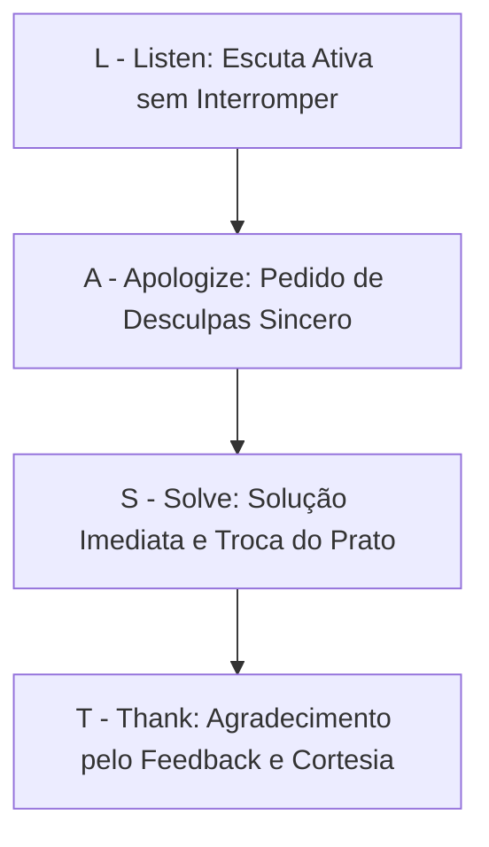

# 📖 DOC-09: Manual de Procedimentos Operacionais Padrão (POPs)
### Unidade: Restaurante Engenho – Shopping Ponta Negra

---

## 📋 POP-01: Recebimento de Cargas na Doca do Shopping Ponta Negra
* **Responsável:** Gerente de Loja ou Estoquista Homologado.
* **Horário Autorizado pelo Shopping:** Exclusivamente das 07h00 às 10h30 (antes da abertura das cancelas ao público).

### Procedimento Passo a Passo:
1. **Apresentação e Descarregamento:**
   * Recepcionar o caminhão baú refrigerado do CDA na Doca 02 (Subsolo do Shopping).
   * Conferir a integridade do lacre do caminhão e verificar se o número bate com a Guia de Remessa.
2. **Aferição Térmica Obrigatória (com Termômetro Espeto Calibrado):**
   * Pescados congelados (Pirarucu / Tambaqui): $\le -18^\circ\text{C}$ (tolerância máxima até $-15^\circ\text{C}$).
   * Carnes bovinas resfriadas (Picanha / Carne de Sol): $0^\circ\text{C}$ a $+4^\circ\text{C}$.
   * Se a temperatura estiver fora do padrão, **recusar o lote imediatamente**, fotografar o termômetro no app e registrar no Módulo CDA.
3. **Conferência Quantitativa & Glosas:**
   * Pesar 100% dos pescados, camarões e queijos de coalho na balança da antecâmara.
   * Se houver divergência entre o peso faturado e o peso real, assinalar divergência no app para ajuste contábil automático com o CDA.
4. **Transporte Interno:**
   * Transportar os insumos em caixas plásticas higienizadas diretamente pelos elevadores de serviço até as câmaras frias da loja em no máximo 20 minutos (sem quebra da cadeia de frio).

---

## 📋 POP-02: Gestão de Boqueta & Controle de Tempo de Prato em Picos
* **Responsável:** Sous-Chef e Gerente de Salão.
* **Meta de Tempo:** $\le 22$ minutos (Almoço Executivo) | $\le 32$ minutos (Pratos Principais de Domingo).

### Procedimento Passo a Passo:
1. **Auditoria Visual de Boqueta (Antes do Prato Sair ao Garçom):**
   * Conferir a louça: bordas 100% limpas (sem respingos de molho de tucupi ou gordura).
   * Temperatura do prato: prato quente deve ser servido fumegante; saladas e ceviches perfeitamente resfriados.
   * Ponto da proteína: cortar pequenos cortes de teste se houver dúvida ou checar com o termômetro espeto térmico interno.
2. **Sincronia de Mesa:**
   * Nenhum prato de uma mesa com múltiplos convidados deve sair isolado com mais de 2 minutos de diferença dos demais. Todos os convidados da mesa devem ser servidos juntos.
3. **Alerta de Mesa em Atraso (Painel Amarelo > 25 min):**
   * O app sinaliza a comanda que excedeu 25 minutos. O gerente deve se dirigir à boqueta, cobrar prioridade imediata e, se necessário, enviar um couvert de cortesia à mesa para suavizar a espera.

---

## 📋 POP-03: Protocolo L.A.S.T. para Resolução de Conflitos na Mesa
* **Responsável:** Gerente Geral ou Subgerente.
* **Objetivo:** Transformar um cliente insatisfeito em um promotor fiel da marca.

1. **L - Listen (Ouvir):** Aproxime-se da mesa com postura aberta, olhando nos olhos do cliente. Deixe o cliente falar todo o seu descontentamento sem interromper nem tentar justificar ("a cozinha está cheia").
2. **A - Apologize (Desculpar-se):** Reconheça o problema com humildade corporativa: *"O senhor tem toda razão, isso não condiz com o padrão de qualidade do Engenho. Peço sinceras desculpas."*
3. **S - Solve (Resolver na Hora):** Retire imediatamente o prato com problema. Acione o Chef de Cozinha para refazer o prato em **prioridade zero** (saída em menos de 10 minutos).
4. **T - Thank & Delight (Agradecer e Encantar):** Ofereça uma cortesia elegante enquanto o novo prato é preparado (ex: um chopp bem tirado, uma taça de vinho ou um café gourmet com sobremesa da casa ao final). Agradeça pelo relato sincero.

---

## 📋 POP-04: Aferição Sanitária Diária de Frio (ANVISA)
* **Responsável:** Chef de Cozinha / Gerente.
* **Frequência:** 2 vezes ao dia (10:30 e 17:00).

### Parâmetros de Conformidade:
| Equipamento | Faixa Térmica Padrão | Ação Corretiva em Desvio |
| :--- | :--- | :--- |
| **Câmara de Congelados (Pescados/Carnes)** | $-18^\circ\text{C}$ a $-22^\circ\text{C}$ | Se atingir $-12^\circ\text{C}$, acionar chamado de emergência no app para manutenção da matriz. |
| **Câmara de Resfriados (Laticínios/Hortifruti)** | $+2^\circ\text{C}$ a $+4^\circ\text{C}$ | Se ultrapassar $+7^\circ\text{C}$, verificar vedação de borracha e transferir laticínios sensíveis. |
| **Balcão de Sobremesas & Pista Fria** | $+2^\circ\text{C}$ a $+5^\circ\text{C}$ | Limpeza de condensador e checagem de fluxo de ar. |
| **Chopeira (Glicol e Temperatura do Barril)** | $-1^\circ\text{C}$ a $+1^\circ\text{C}$ | Regular termostato do banco de gelo para chopp sair entre zero e 1°C na taça. |
