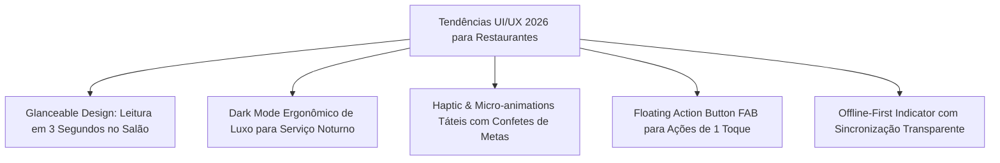

# 💡 DOC-12: Benchmark Competitivo & Insights de Features e UI/UX
### Estudo Global e Nacional de Aplicativos para Gestão de Restaurantes
**Referências Analisadas:** Toast POS, 7shifts, Restaurant365 (R365), MarketMan, SevenRooms, Jolt, ConnectPlug e Projetos Open Source no GitHub.

---

## 🌍 1. Análise dos Líderes de Mercado

| Software | Foco Principal | Melhor Feature Identificada | Ponto Fraco / Oportunidade para o Engenho |
| :--- | :--- | :--- | :--- |
| **Toast POS & GM App** | Operação de Salão & Cozinha | **Lista 86 (Bloqueio de Pratos em Tempo Real)** e sincronia de boqueta com alertas de tempo de mesa. | Muito focado em hardware proprietário; menos focado nas metas financeiras pessoais do gerente. |
| **7shifts** | RH & Escala de Restaurantes | **Labor vs. Sales Tracker** (relação custo de equipe x vendas hora a hora) e chat de equipe integrado. | Não cobre inventário de alto valor (Curva A) nem recebimento de doca com cadeia fria. |
| **Restaurant365 (R365)** | Backoffice, Estoque & CMV | **Contagem cega de inventário**, cálculo de CMV real vs. teórico e integração com centro de distribuição. | Interface considerada densa e com curva de aprendizado íngreme para chão de salão. |
| **SevenRooms / Resy** | Experiência do Cliente & Salão | **Mapa Visual de Mesas (Floor Plan)** com tempo de permanência e histórico de preferências do cliente VIP. | Foco quase exclusivo em reservas; não atua em segurança alimentar nem manutenção de loja. |
| **Jolt / SafetyCulture** | Auditoria Sanitária & ANVISA | Checklists digitais de frio com integração a termômetros e **auditorias fotográficas obrigatórias**. | Aplicativo genérico, não adaptado à culinária brasileira/amazônica nem às particularidades de shopping. |

---

## 🚀 2. Top Features de Alto Impacto para Adicionar ao "Engenho Gestor 360"

### Feature 1: "Lista 86" (Controle de Pratos Esgotados ou Racionados em Tempo Real)
*   **Origem:** Padrão clássico da indústria gastronômica mundial popularizado pelo *Toast POS*. "86" significa prato esgotado.
*   **Aplicação no Engenho Ponta Negra:**
    *   Quando o estoque de Tambaqui Nobre atinge 8 kg no domingo, o gerente ativa no app: **"Racionar Tambaqui - Restam apenas 6 porções"** ou **"86 no Camarão GG"**.
    *   Todos os garçons recebem o alerta visual e sonoro imediato, evitando a situação constrangedora de vender um prato para uma família e a cozinha avisar 20 minutos depois que "o peixe acabou".

### Feature 2: Mapa Visual do Salão (Floor Plan Interativo com Tempo de Mesa)
*   **Origem:** Inspirado no *SevenRooms* e *OpenTable*.
*   **Aplicação no Engenho Ponta Negra:**
    *   Visualização simplificada das mesas do salão principal, varanda e área VIP.
    *   Cores por estágio de atendimento:
        *   🟢 **Verde:** Mesa livre ou recém-ocupada.
        *   🔵 **Azul:** Pratos servidos na mesa (consumo ativo).
        *   🟡 **Amarelo:** Mesa pedindo sobremesa/café (quase liberando).
        *   🔴 **Vermelho:** Comanda com mais de 25 min sem saída de prato (alerta de boqueta!).
    *   Ajuda o gerente a orquestrar o giro de mesa no almoço executivo e no pico de domingo.

### Feature 3: Labor Cost vs. Vendas em Tempo Real (Labor %)
*   **Origem:** O coração do *7shifts*.
*   **Aplicação no Engenho Ponta Negra:**
    *   Mostra o percentual do faturamento gasto com mão de obra no turno: $\text{Labor \%} = \frac{\text{Custo da Escala no Turno}}{\text{Faturamento Realizado}}$.
    *   Faixa saudável: $18\%$ a $22\%$. Se o faturamento estiver muito alto e o labor baixo, o gerente pode acionar um folguista. Se as vendas caírem na terça à tarde, ele ajusta as saídas da brigada.

### Feature 4: Engenharia de Cardápio (Matriz de Rentabilidade / Miller Matrix)
*   **Origem:** *MarketMan* e *Restaurant365*.
*   **Aplicação no Engenho Ponta Negra:**
    *   Classificação dos pratos do cardápio em 4 quadrantes para guiar o briefing do gerente:
        *   ⭐ **Estrelas (Alta Margem + Alta Venda):** Pirarucu em Crosta, Carne de Sol Artesanal (priorizar sempre no briefing).
        *   🐴 **Burros de Carga (Baixa Margem + Alta Venda):** Pratos executivos comerciais (manter volume, mas calibrar porcionamento).
        *   🧩 **Enigmas (Alta Margem + Baixa Venda):** Whiskies 18 anos e Vinhos nobres (estimular upselling com bônus para garçons).
        *   🐕 **Cães (Baixa Margem + Baixa Venda):** Pratos a retirar do cardápio na próxima revisão com a diretoria do Grupo Engenho.

### Feature 5: Registro Rápido com Câmera / Leitor Simulado de QR Code e NF-e
*   **Origem:** Apps modernos de doca e almoxarifado.
*   **Aplicação no Engenho Ponta Negra:**
    *   Escaneamento rápido da etiqueta de lote de pescados congelados do CDA ou da nota fiscal de transferência na doca.

---

## 🎨 3. Tendências de UI/UX para 2026 Incorporadas ao App

1.  **Glanceable Design (Interface de Relance):**
    *   O gerente de restaurante raramente para sentado no escritório durante o pico. Ele olha para o celular com o braço em movimento enquanto caminha entre o salão e a cozinha.
    *   **Solução:** Fontes numéricas grandes e legíveis, badges semafóricos com contraste calibrado e hierarquia visual instantânea.
2.  **Dark Mode de Luxo (Modo Salão Noturno):**
    *   À noite, o restaurante Engenho tem iluminação acolhedora e intimista. Uma tela branca brilhante é desconfortável e chama atenção dos clientes na mesa.
    *   **Solução:** Modo escuro em tons de ardósia nobre e verde amazônico profundo (`#0b0f10` / `#0f392b`).
3.  **Floating Action Button (FAB) de Emergência:**
    *   Um botão flutuante rápido acessível pelo polegar com 3 atalhos imediatos:
        *   *Pausar Prato (Lista 86)*
        *   *Registrar Quebra/Descarte*
        *   *Chamar Copilot para Socorro na Mesa*
4.  **Feedback Sensorial de Vitória (Gamificação do Bônus):**
    *   Ao atingir a meta do dia ou completar o checklist de frio das 17h00 (garantindo os R$ 700,00), a tela emite animação suave de celebração e micro-vibração, reforçando a sensação diária de conquista do bônus de R$ 2.000.
