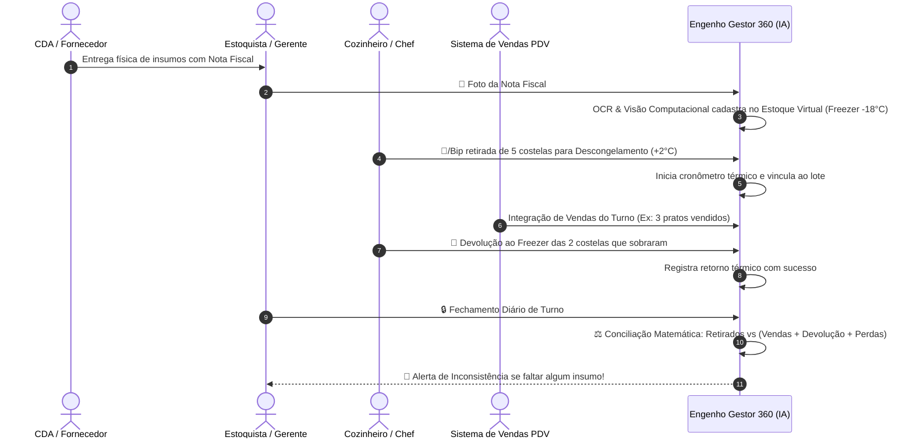
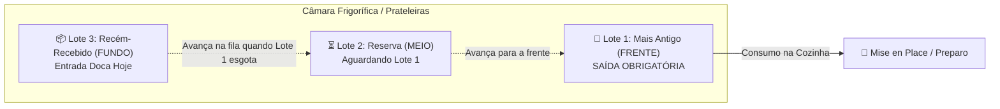

# 🧬 DOC-13: Sistema de Rastreabilidade Total de Insumos & Conciliação com IA
### Ciclo de Congelamento, Descongelamento, Venda e Retorno ao Freezer
**Unidade:** Restaurante Engenho – Shopping Ponta Negra

---

## 🎯 1. Visão Geral do Ciclo de Rastreabilidade

O **Sistema de Rastreabilidade por Visão Computacional & Ciclo Térmico** é uma blindagem definitiva contra desvios, desperdícios ocultos e quebras de cadeia de frio nos insumos nobres da casa (Costela de Tambaqui, Pirarucu, Camarão GG, Carnes Nobres).

---

## 📐 2. A Equação de Conciliação Matemática de Fechamento

Para cada insumo nobre controlado $i$, o fechamento do dia calcula:

$$\Delta_{\text{inconsistência}} = Q_{\text{retirada\_freezer}} - \left( Q_{\text{vendida\_pdv}} + Q_{\text{devolvida\_freezer}} + Q_{\text{quebra\_registrada}} \right)$$

### Matriz de Diagnóstico:
*   Se $\Delta = 0$: **Conformidade Total 🟢 (Bônus de Segurança & Estoque Blindado)**.
*   Se $\Delta > 0$: **Inconsistência Gravíssima 🔴**: Insumos saíram do freezer, não foram registrados como vendidos no PDV, não voltaram para o freezer e não foram lançados como perda autorizada.
    *   *Exemplo clássico:* Saíram 5 costelas de tambaqui, PDV vendeu 1, voltaram 2 para o freezer. $\Delta = 5 - (1 + 2) = +2$ costelas sumidas (Risco de consumo não faturado, porcionamento duplo sem comanda ou extravio).
*   Se $\Delta < 0$: **Divergência Operacional 🟡**: Vendeu-se mais no PDV do que o que foi registrado como retirado do freezer (cozinheiro retirou peças sem bipar o QR Code).

---

## 📱 3. Etapas Operacionais Passo a Passo

### Etapa 1: Entrada de Mercadoria via Foto da Nota Fiscal
1. O colaborador aponta a câmera do celular para a Nota Fiscal / Guia de Transferência do CDA na doca.
2. A IA extrai automaticamente:
   * Código CDA do produto (ex: `PES-0018`);
   * Descrição (ex: *Costela de Tambaqui Nobre*);
   * Lote e validade;
   * Quantidade de porções ou kg (ex: 20 porções de 400g).
3. O app gera os identificadores virtuais e credita automaticamente o lote no **Estoque do Freezer Central (-18°C)**.

### Etapa 2: Saída do Freezer para Descongelamento (+2°C a +4°C)
1. Antes de iniciar o mise en place do almoço ou jantar, o cozinheiro retira as porções necessárias.
2. Com o celular da cozinha, ele bipa o QR Code ou tira uma foto das porções retiradas.
3. O app marca o status: `EM DESCONGELAMENTO / GERAÇÃO DE MISE EN PLACE`.
4. Um cronômetro sanitário é ativado para garantir que o pescado não fique mais de 48h descongelado antes do consumo.

### Etapa 3: Venda Registrada no PDV
1. Durante o serviço, as comandas fechadas nos caixas do salão abatem automaticamente as quantidades no banco de dados.

### Etapa 4: Devolução dos Insumos não Utilizados ao Freezer
1. No final do expediente (às 23h), os insumos que permaneceram refrigerados e não foram preparados retornam ao freezer.
2. O cozinheiro bipa o QR Code das unidades devolvidas e tira a foto de evidência.
3. O app reconhece o lote de origem e carimba o status: `DEVOLVIDO AO FREEZER / SEGUNDO CICLO REGULAMENTADO`.

### Etapa 5: Fechamento Automatizado & Relatório de Inconsistências
1. O gerente clica em **"Auditar Fechamento de Insumos"**.
2. A IA cruza instantaneamente todas as movimentações físicas com as notas fiscais emitidas no dia pelo PDV.
3. Se houver divergência, o app lista na hora:
   * Insumo;
   * Quantidade faltante;
   * Custo financeiro em reais;
   * Colaborador que realizou a retirada original;
   * Horário da operação.

---

## 4. Regra Operacional PEPS (Primeiro que Entra, Primeiro que Sai) / FIFO / PVPS

Conforme a **ANVISA RDC 216** e o padrão de excelência gastronômica do **Grupo Engenho**, a gestão física e sistêmica dos estoques segue o princípio inegociável do **PEPS**:

### Protocolo de Execução no Chão de Loja:
1. **Regra de Armazenamento na Doca:**
   * Qualquer lote recém-descarregado da doca deve ser posicionado **ATRÁS** dos lotes existentes na prateleira da câmara fria.
2. **Regra de Retirada para o Salão / Cozinha:**
   * O cozinheiro retira obrigatoriamente o lote localizado na **FRENTE (1º da Fila PEPS)**.
3. **Bloqueio e Alerta Sistêmico de Violação PEPS:**
   * Se um operador tentar escanear ou registrar a retirada do Lote 2 ou Lote 3 enquanto o Lote 1 ainda possuir saldo ativo, o sistema bloqueia a saída com o pop-up:
     > *"⚠️ Bloqueio Preventivo: Violação do PEPS detectada. O lote [Código] deu entrada anterior e vence mais cedo. A retirada deve ser realizada do lote mais antigo para evitar quebras por validade (PVPS)."*
4. **Baixa PEPS Automática:**
   * Ao efetuar a baixa de $X$ kg no sistema, o algoritmo consome progressivamente os lotes por antiguidade ($L_1 \rightarrow L_2 \rightarrow L_3$), promovendo automaticamente o lote subsequente a "1º da Fila" assim que o saldo anterior é zerado.

