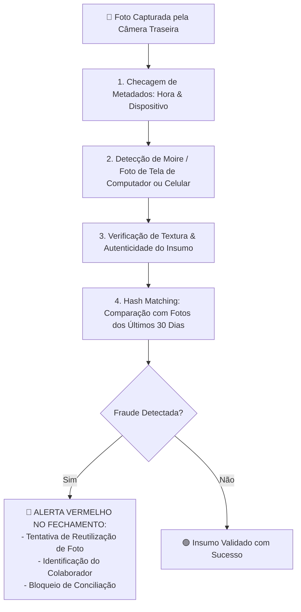

# 🔒 DOC-14: Sistema de Captura Blindada de Câmera & IA Anti-Fraude
### Prevenção de Fraudes em Fotos de Notas Fiscais, Descongelamento e Perdas
**Unidade:** Restaurante Engenho – Shopping Ponta Negra

---

## 🛡️ 1. Diretriz de Segurança: Bloqueio Total da Galeria do Celular

Para eliminar fraudes como:
* Reutilizar fotos de dias anteriores salvas na galeria;
* Tirar fotos da tela de outro celular ou monitor de computador;
* Baixar fotos da internet para simular o insumo ou a nota fiscal;

O aplicativo implementa o protocolo de **Captura Exclusiva em Tempo Real**:
1. **Hardware-Lock (Câmera Traseira Forçada):**
   * A interface web/PWA invoca diretamente o sensor físico traseiro via `navigator.mediaDevices.getUserMedia({ video: { facingMode: 'environment' } })` ou através do atributo restrito HTML5:
     ```html
     <input type="file" accept="image/*" capture="environment" />
     ```
   * O seletor de arquivos do sistema operacional é instruído a **abrir a câmera imediatamente**, sem oferecer ao usuário a opção "Escolher da Galeria" ou "Selecionar Arquivo".
2. **Carimbo Criptográfico Instantâneo:**
   * Cada foto capturada recebe uma marca d'água invisível contendo:
     * Timestamp com precisão de milissegundos;
     * Identificador do dispositivo (Device ID);
     * Usuário logado na sessão;
     * Hash SHA-256 da imagem gerado no momento do clique.

---

## 🤖 2. IA Anti-Fraude: Detecção de Anomalias Visuais (Gemini Vision)

Ao capturar qualquer imagem de insumo, lote ou nota fiscal, o pipeline de Visão Computacional do **Engenho Copilot** submete o quadro a 4 verificações anti-fraude:



### Critérios de Alerta de Fraude da IA:
1. **Padrão de Moiré / Reflexo de Tela:** A IA detecta se a foto foi tirada da tela de outro smartphone ou monitor (linhas de varredura, reflexos de tela e pixels de display LCD/OLED).
2. **Duplicidade Visual (Hash Similaridade > 95%):** A IA compara os ângulos, nós de madeira da bancada da cozinha e posição do alimento com fotos já registradas nos últimos 30 dias. Se for a mesma foto, dispara flag de duplicidade.
3. **Incompatibilidade de Ambiente:** A IA verifica se o fundo da foto corresponde às bancadas de inox padrão da cozinha do Engenho Ponta Negra ou às docas do shopping. Fotos tiradas em mesas de sala ou cozinhas domésticas são rejeitadas.

---

## 🚨 3. Relatório de Inconsistências no Fechamento do Turno

Se qualquer tentativa de fraude for detectada durante o turno, o fechamento do dia do gerente exibe:

```
┌──────────────────────────────────────────────────────────────┐
│ 🚨 ALERTA DE SEGURANÇA: TENTATIVA DE FRAUDE VISUAL          │
├──────────────────────────────────────────────────────────────┤
│ • Insumo: 5 Porções de Costela de Tambaqui                   │
│ • Horário da Captura: 11:15                                  │
│ • Colaborador: Sous-Chef Geovane                             │
│ • Diagnóstico da IA: FOTO DE TELA DETECTADA (Confiança: 98%)  │
│   "A imagem capturada apresenta linhas de varredura (efeito  │
│   moiré) características de fotografia tirada da tela de     │
│   outro celular. A bancada da cozinha não foi reconhecida."  │
│ • Ação Requerida: Homologação presencial do Gerente Geral.  │
└──────────────────────────────────────────────────────────────┘
```
