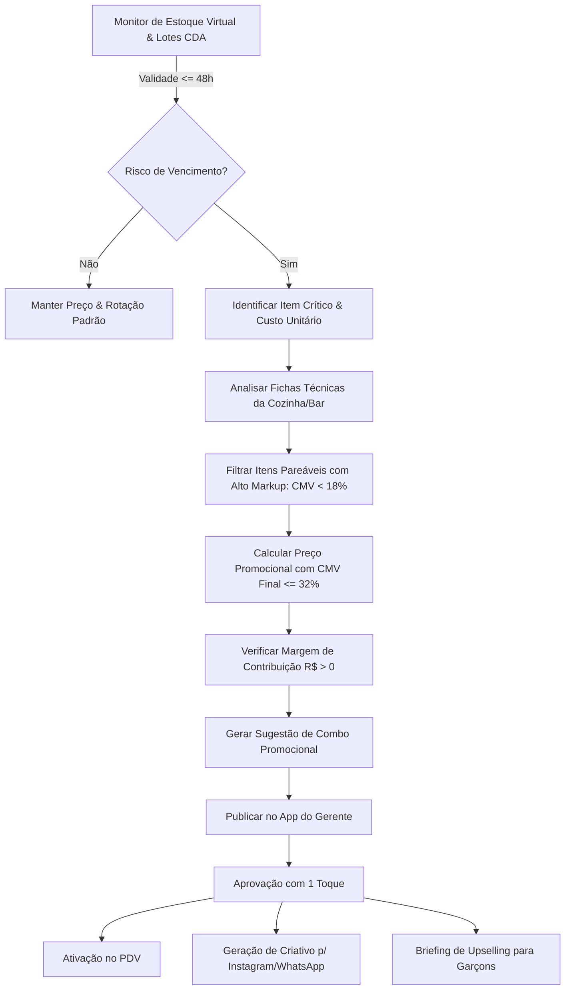

# DOC-15: Marketing Integrado ao Estoque Virtual, Validades & Engenharia de CMV

> **Engenho Gestor 360 — Unidade Shopping Ponta Negra (Manaus/AM)**  
> **Módulo:** *Dynamic Markdown & Waste-Prevention Promo Engine (IA + Ficha Técnica)*  
> **Data:** Setembro/2026 | **Versão:** 1.0.0 Enterprise  

---

## 1. Visão Geral & Problema de Negócio

No setor de Food Service de alto padrão em shoppings de Manaus, o descarte de insumos nobres por vencimento de validade (**shelf-life**) é um dos maiores vilões do **CMV (Custo da Mercadoria Vendida)**. Quando um produto vence:
$$\text{Prejuízo} = 100\% \text{ do Custo de Aquisição} \implies \text{CMV Dispara e Bônus do Gerente é Prejudicado}$$

Para evitar esse desperdício sem canibalizar o faturamento ou "vender com prejuízo", o **Engenho Gestor 360** integra diretamente:
1. **Estoque Virtual em Tempo Real:** Monitora as datas de validade de cada lote recebido do CDA (Princípio PVPS / FEFO - *First Expire, First Out*).
2. **Motor de Fichas Técnicas & CMV Dinâmico:** Ao identificar um lote a vencer em $\le 48\text{h}$, a IA nunca sugere apenas "dar desconto burro". Ela cruza a base de fichas técnicas para encontrar itens complementares com **altíssimo markup e baixo custo** (ex: petiscos à base de farinha, tapioca ou queijo coalho).
3. **Engenharia de Cardápio & Criação de Combos:** Cria combos atrativos onde o item em risco é escoado 100%, gerando margem de contribuição positiva e mantendo o CMV global da refeição abaixo do teto de **30%**.
4. **Disparo Multicanal Imediato:** Gera as campanhas para Instagram (Stories/Feed), WhatsApp para base de clientes VIP de Ponta Negra e scripts de abordagem para os garçons no salão.

---

## 2. O Caso Prático: Chopp Vencendo dia 15/09

### Cenário de Alerta:
- **Insumo:** Barris de Chopp Brahma / Artesanal Regional (Estoque Virtual acusa 2 barris de 50L com validade para **15/09**).
- **Volume em Risco:** ~250 canecas de Chopp (300ml).
- **Custo Unitário da Caneca (Ficha Técnica):** R$ 4,20.
- **Preço Regular no Cardápio:** R$ 14,00.
- **Risco de Descarte se Não Vender até 15/09:** $250 \times \text{R\$ 4,20} = \mathbf{R\$\ 1.050,00}$ de perda direta em dinheiro!

### Estratégia de Combinação da IA (Ficha Técnica Cruzada):
A IA consulta o cardápio e identifica um produto complementar de **baixíssimo CMV** e **alta saída em happy hour**:
- **Item Complementar:** *Dadinhos de Tapioca com Geleia de Pimenta de Cheiro*
  - Custo de Produção (Ficha Técnica): R$ 3,80 (porção com 10 unidades).
  - Preço Regular no Cardápio: R$ 28,00.
  - Markup Regular: $7,3\times$ (CMV de apenas 13,5%).

### Montagem do Combo Anti-Desperdício (Dias 14 e 15/09):
- **Oferta:** *Combo Happy Hour Ponta Negra: 2 Chopps Gelados + 1 Porção de Dadinhos de Tapioca*.
- **Preço Regular Separado:** $2 \times \text{R\$ 14,00} + \text{R\$ 28,00} = \text{R\$ 56,00}$.
- **Preço Promocional do Combo:** **R$ 38,90** (Desconto atrativo de 30,5%).
- **Custo Total do Combo (CMV Físico):**
  $$\text{Custo} = (2 \times \text{R\$ 4,20}) + \text{R\$ 3,80} = \text{R\$ 8,40} + \text{R\$ 3,80} = \mathbf{R\$\ 12,20}$$
- **CMV Percentual do Combo:**
  $$\text{CMV} = \frac{\text{R\$ 12,20}}{\text{R\$ 38,90}} = \mathbf{31,3\%} \quad (\text{Dentro da faixa segura!})$$
- **Margem de Contribuição Líquida em R$:**
  $$\text{Margem} = \text{R\$ 38,90} - \text{R\$ 12,20} = \mathbf{R\$\ 26,70 \text{ de lucro bruto por combo vendido!}}$$

**Resultado Financeiro:**  
Em vez de jogar R$ 1.050,00 no lixo por vencimento, a venda de 100 combos nos dias 14 e 15/09 gera **R$ 3.890,00 de faturamento extra**, **R$ 2.670,00 de margem de contribuição** e **zero perda de insumo**!

---

## 3. Matriz de Decisão do Algoritmo de IA

---

## 4. Comunicação Multicanal Automatizada

Quando o gerente aprova a promoção no painel do app, a IA gera automaticamente 3 peças de comunicação:

### 1. Instagram Stories / Feed (Cópia Pronta):
> *"O pôr do sol na Ponta Negra pede um brinde especial! ☀️🍺 Nesta segunda e terça (14 e 15/09), aproveite nosso Combo Happy Hour: 2 Chopps estupidamente gelados + 1 porção crocante de Dadinhos de Tapioca com geleia artesanal de pimenta de cheiro por apenas R$ 38,90! Válido a partir das 17h no Restaurante Engenho – Shopping Ponta Negra (Piso L3). Vem viver essa experiência amazônica!"*

### 2. WhatsApp VIP (Broadcast para Clientes Cadastrados):
> *"Olá, [Nome]! Tudo bem? Passando para te contar que preparamos uma condição exclusiva para o início da sua semana aqui no Engenho Ponta Negra. Nos dias 14 e 15, peça 2 Chopps + Dadinhos de Tapioca com mais de 30% OFF (de R$ 56 por R$ 38,90). Que tal dar uma pausa no trabalho e curtir o fim de tarde com a gente? Te esperamos!"*

### 3. Script de Salão (Briefing dos Garçons no App do RH):
> *"Equipe de salão: foco total nos dias 14 e 15 no Combo Chopp + Dadinho. Ao abrir a mesa, a frase de abordagem é: 'Boa tarde! Para abrir o apetite enquanto escolhem os pratos, nosso chef preparou hoje o Combo da Tarde: 2 chopps artesanais trincando e os dadinhos de tapioca crocantes com condição especial no cardápio.' Cada 5 combos vendidos rendem +5 pontos no ranking de upselling do turno!"*

---

## 5. Benefício Direto nas Metas e no Bônus do Gerente

1. **Segurança dos Alimentos (35% - R$ 700,00):** Elimina o risco de a vigilância ou auditoria encontrar insumos fora da validade nos refrigeradores.
2. **Avaliação do Cliente / NPS (25% - R$ 500,00):** O cliente sente que recebeu uma oportunidade imperdível e elogia a experiência e o happy hour no Google Maps.
3. **Meta de Vendas Mensal (40% - R$ 800,00):** Transforma produtos que seriam lixo em R$ 3.800+ de receita adicional em dias de menor movimento (segunda e terça), garantindo o atingimento da meta de faturamento.
