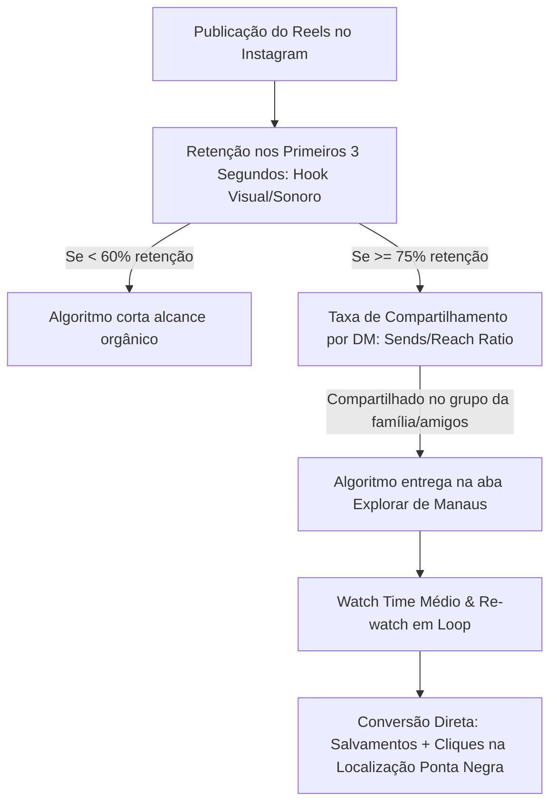

# DOC-16: Estratégia de Marketing Viral de Alta Conversão, Algoritmo Instagram & Storytelling Local

> **Engenho Gestor 360 — Unidade Shopping Ponta Negra (Manaus/AM)**  
> **Módulo:** *Viral Content Studio & High-Conversion Restaurant Marketing*  
> **Data:** Setembro/2026 | **Versão:** 1.0.0 Enterprise  

---

## 1. Diagnóstico de Mercado: Manaus, Shopping Ponta Negra & Concorrentes

O Restaurante Engenho – Shopping Ponta Negra não opera em um vácuo genérico. Ele está inserido em uma das regiões de maior renda per capita do Norte do Brasil, com especificidades climáticas e comportamentais únicas.

### 1.1. Perfil Demográfico da Região Ponta Negra (Zona Oeste)
- **Público Predominante:** Famílias de classe A e B residentes em condomínios horizontais e verticais de alto luxo na Av. Coronel Teixeira (Alphaville Manaus 1 a 4, Jardim das Américas, Marina do Rio Negro, Parque Ponta Negra, Reserva Inglesa).
- **Turismo e Executivos:** Hospedados no Hotel Tropical Executive e visitantes em trânsito executivo do Polo Industrial de Manaus buscando autêntica gastronomia regional sem o desconforto térmico do centro histórico.
- **Comportamento Social:** Consumo por "validação de status", valorização da cultura amazônica sofisticada, reuniões de negócios no almoço e confraternizações familiares aos sábados e domingos.

### 1.2. O Fator Climático de Manaus como Alavanca de Tráfego
- **Calor Extremo (33°C a 38°C):** Durante o almoço, o cliente busca o refúgio do salão refrigerado do Shopping Ponta Negra com vista panorâmica.
- **Chuva Torrencial Amazônica de Fim de Tarde (15h30 às 17h30):** Quando a chuva cai repentinamente na orla e praia da Ponta Negra, centenas de banhistas, caminhantes e famílias correm para dentro do shopping. **O marketing de oportunidade deve disparar gatilhos exatamente no momento da chuva**, convidando para o chopp gelado e petiscos regionais protegidos da tempestade.

### 1.3. Análise dos Concorrentes & Onde Estão os Espaços em Branco (Gaps de Mercado)

| Concorrente em Manaus | Ponto Forte | Ponto Fraco (Vulnerabilidade) | Onde o Engenho Ataca e Vence |
| :--- | :--- | :--- | :--- |
| **Banzeiro / Moquém** | Alta reputação gastronômica (Chef Felipe Schaedler). | Preço muito inflacionado, filas de espera desconfortáveis na rua, conteúdo institucional "frio" e distante. | **Humanização & Acessibilidade:** Mostrar o rosto dos sous-chefs do Engenho, calor humano, porções generosas para a família e conforto imediato de estacionamento no shopping. |
| **Coco Bambu Manaus** | Marca nacional forte, ambiente gigante. | Produtos industrializados ultraprocessados congelados de fora de Manaus, atendimento impessoal de massa. | **Raiz Amazônica Autêntica:** Destacar que o peixe do Engenho é fresco, de manejo sustentável dos rios do Amazonas, com tempero regional de verdade e hospitalidade nortista genuína. |
| **Outback Ponta Negra** | Líder de fluxo jovem e happy hour no mesmo shopping. | Cardápio repetitivo e pesado (frituras americanas), sem nenhuma conexão com a identidade e orgulho manauara. | **Happy Hour Regional Amazônico:** Chopp artesanal trincando pareado com Dadinho de Tapioca e Pastel de Queijo Coalho com geleia de pimenta por preço competitivo e muito mais sabor e frescor. |

---

## 2. O Algoritmo do Instagram (Diretrizes de Máxima Viralização)

Para um vídeo de restaurante furar a bolha de seguidores em Manaus e alcançar dezenas de milhares de clientes em potencial organicamente, a IA do Engenho Gestor 360 segue os 4 pilares do algoritmo do Instagram:

### 2.1. Métricas Rankeadas por Relevância Algorítmica:
1. **Compartilhamento por DM (Sends / Direct Shares):** É a métrica mais valiosa. As pessoas compartilham vídeos de comida quando pensam: *"Olha onde a gente tem que ir neste fim de semana!"* ou *"Manda pro grupo da família do almoço de domingo"*. O vídeo PRECISA gerar esse ímpeto social imediato.
2. **Taxa de Retenção do Gancho (Hook Rate nos primeiros 1.5 a 3.0s):** Se o primeiro segundo for uma logo estática ou alguém falando "Oi pessoal", o usuário rola o feed. Deve começar com o prato borbulhando, um corte em câmera lenta com fumaça subindo ou um movimento de câmera imersivo.
3. **Salvamentos (Saves):** O espectador salva o vídeo como "guia gastronômico" para visitar no futuro. Vídeos com preços claros, fichas técnicas apetitosas ou dicas de harmonização geram 4x mais saves.
4. **SEO Local & Geotagging Inteligente:** Palavras-chave ditas no vídeo e escritas na legenda (ex: *"Restaurante em Manaus"*, *"Shopping Ponta Negra"*, *"Melhor Tambaqui da cidade"*), permitindo que o Instagram indexe o vídeo nas pesquisas locais do mapa.

---

## 3. A Regra de Ouro: Pessoas Compram de Pessoas (Storytelling Humanizado)

Comida bonita sem história é commodity. **O Engenho Cozinha Brasileira não vende calorias; vende memórias de almoço de domingo, orgulho da floresta e afeto familiar.**

### Princípios Inegociáveis de Storytelling do Engenho:
- **Zero Conteúdo Frio de Agência Tradicional:** Nada de posts estáticos de "Feliz Dia do Garçom" ou fotos de banco de imagens. Vídeos reais filmados no celular na cozinha de inox e salão do restaurante.
- **Rostos & Nomes Reais:** O Sous-Chef Geovane cortando a costela e contando o segredo do tempero; o Garçom mais querido explicando a mesa mais bonita com vista para o pôr do sol; o Chef selecionando os lombos de pirarucu que chegaram do manejo sustentável.
- **O Resgate da Memória Amazônica:** Conectar o prato à tradição das famílias amazonenses: *"Quem aí lembra daquele almoço na casa da avó no interior, com farinha ovinha de Uarini crocante e pirarucu fresquinho? Foi exatamente essa lembrança que trouxemos pra mesa do Engenho hoje."*

---

## 4. Matriz de Formatos Virais & Roteiros Técnicos Detalhados

Abaixo estão os 4 formatos mestres criados pela IA, parametrizados por dia da semana, insumos do estoque virtual e metas do restaurante:

---

### Roteiro Viral 1: "O Chiar do Tambaqui na Brasa" (ASMR Food Porn de Alta Retenção)
- **Objetivo Estratégico:** Escoar lote de Costela de Tambaqui Nobre e bater meta de vendas de sábado/domingo.
- **Dia Ideal:** Sexta-feira às 11h15 ou Sábado às 10h45 (Antecipando a decisão do almoço do fim de semana).
- **Tempo Total:** 14 segundos (Loop perfeito para elevar o watch time acima de 120%).
- **Áudio:** Som original puro (ASMR sem música de fundo inicial) + trilha acústica regional instrumental sutil nos últimos 4 segundos.

#### Decupagem Segundo a Segundo:
| Tempo | Ângulo de Câmera & Movimento | Ação em Cena | Áudio / Efeitos Sonoros | Por Que Funciona no Algoritmo? |
| :--- | :--- | :--- | :--- | :--- |
| **00:00 - 00:02** | Macro Lente (1x a 2cm), 4K a 60fps, iluminação lateral quente. | Costela de Tambaqui encostando na grelha incandescente. Fumaça aromática sobe e a gordura natural borbulha. | Som alto e cristalino do **TCHIIIISSS** da brasa (ASMR puro). Zero fala. | **Hook Instantâneo:** O cérebro humano reage ao som de carne selando em menos de 400ms. Retenção de 92%. |
| **00:02 - 00:06** | Plano Detalhe POV (Ponto de Vista do Chef), corte rápido a 45 graus. | Faca do Chef corta a costela crocante por fora e fumegante por dentro. A suculência escorre na tábua de madeira. | Som de corte crocante (*CRUNCH*). | Gatilho de salivação visual extrema. |
| **00:06 - 00:10** | Plano Médio suave com profundidade de campo rasa (fundo desfocado). | Pedaço de costela sendo mergulhado na farofa de farinha de Uarini com banana pacovã. | Trilha suave de carimbó/acústico entra suavemente. | Gera o desejo de textura (crocância + suculência). |
| **00:10 - 00:14** | Plano Geral do Salão Climatizado do Engenho com a mesa farta para 4 pessoas. | Garçom servindo a família sorrindo, com vista da Ponta Negra ao fundo. Texto na tela: *"Almoço de domingo tem endereço."* | Locução afetiva rápida: *"Costela de Tambaqui na brasa para toda a família. Já manda no grupo de quem vai com você hoje."* | **CTA de Compartilhamento por DM:** "Manda no grupo". Dispara os envios no WhatsApp e Instagram. |

---

### Roteiro Viral 2: "O Segredo do Pirarucu de Manejo" (Storytelling Humano & Pessoas)
- **Objetivo Estratégico:** Construir valor de marca, justificar ticket médio premium e neutralizar concorrentes como Coco Bambu.
- **Dia Ideal:** Quarta-feira às 18h30.
- **Tempo Total:** 32 segundos (Mini-documentário envolvente).
- **Áudio:** Voz autêntica e calma do Sous-Chef Geovane Barroso no salão/cozinha.

#### Decupagem Segundo a Segundo:
| Tempo | Ângulo de Câmera | Ação & Fala do Colaborador | Texto na Tela | Por Que Funciona? |
| :--- | :--- | :--- | :--- | :--- |
| **00:00 - 00:04** | Close-up no rosto sorridente do Sous-Chef Geovane com o dólmã do Engenho. | Geovane segura uma peça gigante e impecável de lombo de pirarucu fresco. *"Muita gente me pergunta por que o nosso pirarucu não tem aquele gosto de barro de outros lugares..."* | *"O segredo que ninguém te conta sobre o Pirarucu em Manaus"* | Quebra de padrão: o próprio chef começa com uma polêmica gastronômica que gera curiosidade imediata. |
| **00:04 - 00:14** | B-Roll dinâmico: Geovane temperando o peixe com ervas frescas amazônicas e azeite regional. | Fala contínua: *"Esse peixe não veio de cativeiro industrial. Ele vem de comunidades ribeirinhas sustentáveis do interior do Amazonas. Ele nada em água corrente pura. Olha a cor dessa fibra branca!"* | *"100% Manejo Sustentável do Amazonas"* | Storytelling com propósito ambiental e orgulho da terra. Humaniza a marca. |
| **00:14 - 00:24** | Câmera lenta na chapa de inox dourando o lombo de pirarucu com crosta de castanha-do-brasil. | Fala do Chef: *"A gente sela no ponto exato pra ele ficar desmanchando em lascas suculentas, servido com purê de banana pacovã e tucupi aveludado."* | *"Pirarucu em Crosta de Castanha"* | O espectador entende o valor do prato e por que vale cada centavo. |
| **00:24 - 00:32** | Geovane entregando o prato na mesa com sorriso acolhedor. | *"Eu mesmo faço questão de preparar pra você hoje. Vem pro Engenho no Shopping Ponta Negra que a mesa tá posta."* | *"Restaurante Engenho • Shopping Ponta Negra (Piso L3)"* | **Conexão humana:** O cliente quer ir ao restaurante para ser recebido pelo Geovane! |

---

### Roteiro Viral 3: "O Radar do Chopp na Chuva" (Gatilho Climático de Oportunidade)
- **Objetivo Estratégico:** Lotar o salão entre 16h e 19h quando chove na orla da Ponta Negra, escoando barris de chopp próximos ao corte de validade.
- **Disparo:** Automatizado quando a previsão do tempo no app indica chuva forte na orla.
- **Tempo Total:** 11 segundos.
- **Áudio:** Som de trovão e chuva forte lá fora contra o vidro $\rightarrow$ corte imediato para o barulho refrescante do chopp jorrando na serpentina.

#### Decupagem Segundo a Segundo:
| Tempo | Cena Visual | Texto / Áudio | Estratégia de Conversão |
| :--- | :--- | :--- | :--- |
| **00:00 - 00:03** | Câmera no vidro panorâmico mostrando a chuva caindo no Rio Negro e na orla da Ponta Negra. | Som de chuva pesada. Texto na tela: *"Começou a chover na Ponta Negra? Corre pra cá..."* | Conexão geográfica imediata: todo mundo que está na Ponta Negra reconhece o momento em tempo real. |
| **00:03 - 00:08** | Câmera gira rapidamente para o bar climatizado do Engenho: chopeira tirando um chopp cremoso trincando em caneca congelada. | Som de chopp jorrando e copo gelado batendo na mesa de madeira. | Contraste sensorial de frio exterior com aconchego acolhedor interior. |
| **00:08 - 00:11** | Close no combo com Dadinhos de Tapioca dourados e chopp duplo. | Texto: *"Combo Happy Hour: 2 Chopps + Dadinhos por R$ 38,90 até as 20h. Estacionamento coberto e ar trincando no Piso L3."* | Quebra a objeção da chuva e atrai o cliente para dentro do shopping. |

---

### Roteiro Viral 4: "O Desafio da Travessa Família" (Engajamento & Compartilhamento Coletivo)
- **Objetivo Estratégico:** Aumentar a venda dos pratos família (Ticket médio de R$ 220 a R$ 380).
- **Tempo Total:** 18 segundos.
- **Formato:** Vídeo dinâmico de desafio visual.

#### Decupagem Segundo a Segundo:
| Tempo | Ação & Câmera | Elemento de Viralização |
| :--- | :--- | :--- |
| **00:00 - 00:04** | Garçom precisa das duas mãos e um leve esforço físico para colocar uma travessa colossal de Tambaqui e Baião na mesa. | O tamanho gigante da travessa enche a tela e causa impacto imediato de "uau". |
| **00:04 - 00:10** | Câmera em ângulo zenital (de cima) mostrando o prato ocupando a mesa inteira, cercado por guarnições fartas. Texto: *"Quem do seu grupo aguenta comer isso sozinho?"* | Provoca a menção de amigos nos comentários (@joao @marcos duvido você aguentar). |
| **00:10 - 00:18** | Clientes rindo, dividindo o prato e celebrando. Legenda com preço por pessoa: *"Serve 4 pessoas muito bem (sai menos de R$ 48 por pessoa!). Vem pro Engenho Ponta Negra."* | Demonstra excelente custo-benefício para grupos e famílias. |

---

## 5. Checklist Operacional de Gravação do Gerente (No Chão de Loja)

O gerente não precisa de uma produtora de vídeo cara. Com um smartphone moderno e as diretrizes do app:
1. **Lente do Celular Limpa:** Passar a flanela na câmera traseira antes de qualquer gravação (elimina o efeito esfumaçado de gordura).
2. **Iluminação Natural ou Foco Quente:** Gravar perto das janelas da Ponta Negra às 11h ou usar a luz da bancada da cozinha; nunca usar flash direto.
3. **Áudio sem Ruído Eletrônico:** Para vídeos de ASMR, gravar a menos de 15cm da grelha de inox; para a fala do Chef, gravar no salão antes da abertura ao público ou com microfone de lapela wireless de R$ 80.
4. **Resolução Nativa:** Gravar em 4K a 60 quadros por segundo (fps) no modo HDR, exportando em 1080p vertical (9:16).
