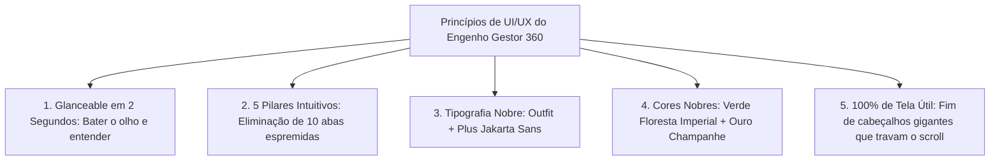

# DOC-18: UI/UX Design System Premium, Calm Technology & Navegação Intuitiva

> **Engenho Gestor 360 — Unidade Shopping Ponta Negra (Manaus/AM)**  
> **Módulo:** *Premium UI/UX Architecture, Cognitive Load Reduction & Design System*  
> **Data:** Setembro/2026 | **Versão:** 2.0.0 Enterprise  

---

## 1. O Desafio de UI/UX em Food Service de Alto Padrão

Um gerente de restaurante **não é um analista sentado atrás de uma mesa com duas telas grandes**.  
Ele opera em pé, em constante movimento pelo salão climatizado, conversando com o chef na cozinha de inox, inspecionando mesas de clientes da classe A/B e checando o smartphone com apenas uma das mãos entre uma demanda e outra.

### Os Dois Maiores Erros de Softwares Tradicionais de Restaurante:
1. **"Cockpit de Avião Confuso" (Poluição Visual):** Aplicativos que colocam 10 a 15 botões no rodapé, centenas de dados amontoados sem respiro e formulários infinitos. Isso gera estresse e cansaço visual.
2. **"Design Genérico de Agência":** Cores cinzas frias, sem personalidade de marca, sem contraste tátil e sem hierarquia tipográfica clara.

---

## 2. A Filosofia de Design: *Calm Technology & Glanceable Design*

A experiência do **Engenho Gestor 360** foi reformulada seguindo os padrões das maiores referências de hospitalidade e fintech de ultra-luxo do mundo (Apple Human Interface Guidelines, Linear, SevenRooms e Toast Enterprise):

---

## 3. A Nova Arquitetura de Navegação em 5 Pilares Ergonômicos

Em vez de 10 botões espremidos no rodapé do celular, consolidamos o ecossistema em **5 Pilares Intuitivos** com seletores suaves de pílula (*Segmented Controls*) no topo de cada visão:

| Pilar no Rodapé | Ícone | O Que Agrega (Sem Complexidade) | Navegação Interna Suave |
| :--- | :--- | :--- | :--- |
| **1. Dono & DRE** | 👑 Crown | Visão do Proprietário, DRE Diário em Tempo Real, Prevenção de Perdas, Cockpit de Bônus (R$ 2.000) e Faturamento. | Alternância em 1 toque: `[ Visão de Dono & DRE ]` $\leftrightarrow$ `[ Metas & Bônus R$ 2k ]`. |
| **2. Salão & Mesas**| 🍽️ Utensils | Chão de Loja: Mapa de Mesas (SevenRooms), Lista 86 (Toast), Rastreabilidade Térmica (Câmera Anti-Fraude) e Checklists ANVISA. | Alternância em 1 toque: `[ Salão & Mesas ]` $\leftrightarrow$ `[ Rastreio & Câmera ]` $\leftrightarrow$ `[ Checklists ANVISA ]`. |
| **3. Estoque & CDA**| 📦 Package | Cadeia de Suprimentos: Auditoria de Curva A, Registro de Quebras e Hub CDA com corte das 15h e doca. | Alternância em 1 toque: `[ Estoque Curva A ]` $\leftrightarrow$ `[ Hub CDA & Doca ]`. |
| **4. Mkt & Reels** | 🔥 Flame | Crescimento da Loja: Estúdio de Reels Virais (Algoritmo Instagram Manaus), Combos Anti-Desperdício (CMV) e Avaliações Google (NPS). | Abas integradas com visual de estúdio de criação e cópias em 1 toque. |
| **5. Equipe RH** | 👥 Users | Brigada do Restaurante: Escala 6x1 com validação de domingos, Briefing de 5 Minutos do Turno e Ranking de Upselling de Garçons. | Painel de pessoas focado em motivação e conformidade legal CLT. |
| **+ Copilot IA** | ✨ Sparkles | Assistente com Protocolo L.A.S.T. e Coaching de Metas. | Acesso sempre disponível com visual reluzente de IA. |

---

## 4. Tipografia & Design Tokens de Alto Padrão

- **Fonte de Títulos & Destaques:** **`Outfit`** (Google Fonts)  
  *Características:* Geométrica, moderna, com ar de gastronomia contemporânea e sofisticação de shopping center classe A.
- **Fonte de Leitura & Interface:** **`Plus Jakarta Sans`** (Google Fonts)  
  *Características:* Projetada especificamente para telas de alta densidade (Retina/OLED), com clareza cristalina de números financeiros e legibilidade imediata sob iluminação variável.
- **Paleta de Cores Harmônica:**
  - **Verde Floresta Imperial (`#0A2E23` / `#0D382B`):** Conexão com as raízes amazônicas e sofisticação da alta culinária.
  - **Ouro Champanhe (`#D97706` / `#F59E0B`):** Acentos de vitória, metas batidas e elementos premium.
  - **Fundo Calmante (`#F7F9F8`):** Off-white quente que descansa a vista e destaca os cartões de dados.
  - **Vidro Fosco (*Glassmorphism*):** `backdrop-blur-xl` com bordas ultra-finas `border-slate-200/80` que criam profundidade sem pesar.
