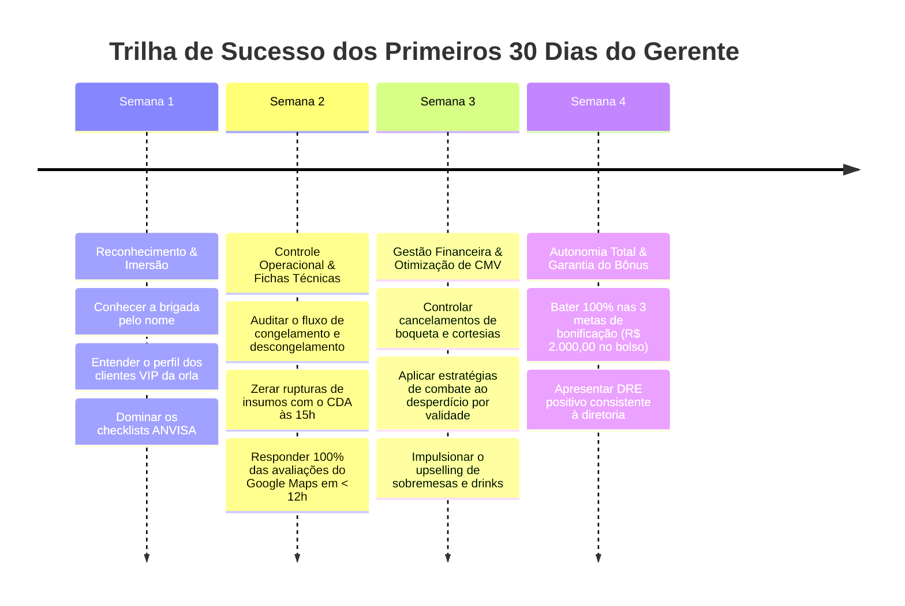

# DOC-19: Manual de Onboarding & Guia de Sucesso do Novo Gerente

> **Engenho Gestor 360 — Unidade Shopping Ponta Negra (Manaus/AM)**  
> **Destinatário:** Gerente Geral da Loja | **Grupo Engenho**  
> **Data:** Setembro/2026 | **Versão:** 1.0.0 Enterprise  

---

## 1. Boas-Vindas & Missão do Gerente Geral

Parabéns pela liderança da unidade **Restaurante Engenho – Shopping Ponta Negra**!  
Você não é apenas um supervisor de funcionários; você é o **embaixador da hospitalidade brasileira e amazônica na região mais nobre de Manaus** e o **guardião do lucro e da qualidade da casa**.

### Os Três Pilares da Sua Liderança:
1. **Cultura de Excelência & Hospitalidade:** O cliente que senta no Engenho Ponta Negra busca uma experiência memorável (comida farta, peixe fresco impecável, chopp trincando e ambiente acolhedor).
2. **Visão de Dono (Owner Mindset):** Cada grama de carne nobre, cada garrafa de cerveja e cada centavo de cortesia devem ser administrados como se o dinheiro saísse do seu próprio bolso.
3. **Coaching & Engajamento da Brigada:** Desenvolver sua equipe de garçons, cumins, cozinheiros e sous-chefs, transformando garçons em consultores de vendas (upselling) e a cozinha em uma fábrica suíça de precisão.

---

## 2. Dossiê da Unidade Shopping Ponta Negra

- **Localização:** Shopping Ponta Negra – Piso L3 (Praça de Alimentação / Corredor Gastronômico), Av. Coronel Teixeira, 5705 – Ponta Negra, Manaus/AM.
- **Capacidade:** 160 lugares simultâneos (Salão Principal Climatizado, Varanda com Vista Panorâmica da Orla e Espaço Reservado para Famílias/Eventos).
- **Público-Alvo:** Moradores de alto poder aquisitivo dos condomínios da orla (Alphaville Manaus 1 a 4, Jardim das Américas, Marina do Rio Negro, Reserva Inglesa), executivos do Polo Industrial de Manaus e turistas.
- **Horários de Funcionamento:**
  - *Segunda a Sexta:* 11h30 às 15h30 (Almoço Executivo) e 17h30 às 22h30 (Happy Hour & Jantar).
  - *Sábado, Domingo e Feriados:* 11h30 às 23h00 (Operação contínua com pico familiar extremo das 12h às 16h).
- **Clima Local:** Calor de até 38°C (o ar condicionado a 22°C é um ativo de vendas!) e chuvas torrenciais no fim da tarde que empurram os frequentadores da praia para dentro do shopping.

---

## 3. O Cronograma da Sua Rotina Diária (Hora a Hora)

| Horário | Atividade Estratégica | O Que Você Deve Fazer no App / Chão de Loja |
| :--- | :--- | :--- |
| **09h30 - 10h15** | **Abertura da Loja & Inspeção Física** | - Abrir o app e checar se as **câmaras frigoríficas** amanheceram na temperatura correta (-18°C congelados / +2°C resfriados). - Percorrer salão, bar e banheiros checando limpeza e aroma. |
| **10h15 - 10h45** | **Checklist Matinal & Estoque Curva A** | - Preencher o Checklist Sanitário ANVISA no app. - Auditar visualmente o freezer de carnes e peixes nobres (Tambaqui, Pirarucu, Picanha de Sol). |
| **11h00 - 11h15** | **Briefing de 5 Minutos da Brigada** | - Reunir salão e cozinha. - Celebrar o ranking de upselling do dia anterior. - Definir o prato do dia e conferir a **Lista 86** (itens esgotados/racionados). |
| **11h30 - 15h00** | **Pico do Almoço (Show Time)** | - Postura de anfitrião: circular entre as mesas, cumprimentar clientes VIPs. - Monitorar o tempo de boqueta no Mapa de Mesas (pratos em $\le 22$ min). - Auditar qualquer cancelamento de pedido em tempo real. |
| **15h00 - 15h30** | **Janela Crítica do CDA (Corte às 15h)** | - **IMPERDÍVEL:** Abrir a aba **Suprimentos $\rightarrow$ Hub CDA** e revisar a sugestão preditiva de compras da IA. - Transmitir o pedido ao Centro de Distribuição antes das 15h00 para entrega no dia seguinte. |
| **15h30 - 17h00** | **Gestão de Vale & Marketing Preditivo** | - Conferir o radar meteorológico: se houver previsão de chuva na Ponta Negra, ativar o gatilho de post do Chopp no app. - Checar se há insumos vencendo em 48h e ativar combos com Ficha Técnica. |
| **17h30 - 21h30** | **Pico do Jantar & Happy Hour** | - Foco na venda de petiscos, drinks regionais e chopp trincando. - Incentivar os garçons no upselling de sobremesas (Cartola Amazônica). |
| **22h00 - 23h00** | **Fechamento, Auditoria & DRE Diário** | - Auditar fechamento cego de caixa (sem divergências). - Abrir a aba **Rastreio $\rightarrow$ Auditoria Fechamento** e conciliar: saídas de insumos vs. vendas do PDV. - Verificar se a IA detectou alguma tentativa de fraude de fotos. - Conferir o **Lucro Líquido Real do Dia no DRE** e enviar relatório executivo à diretoria. |

---

## 4. O Plano dos Seus Primeiros 30 Dias no Cargo

---

## 5. Matriz de Contatos de Emergência & Suporte Corporativo

- **CDA Grupo Engenho (Separação & Logística):** Tel/WhatsApp: (92) 98111-4001 | E-mail: pedidos.cda@grupoengenho.com.br
- **Manutenção Predial & Refrigeração:** Plantão 24h: (92) 98400-9911 (Técnico Marcos Vinícius)
- **Administração Shopping Ponta Negra (Operações/Doca):** Ramal interno: 2101 / Central de Segurança: 2109
- **RH Matriz Grupo Engenho:** (92) 3644-8800 | E-mail: rh.corporativo@grupoengenho.com.br
