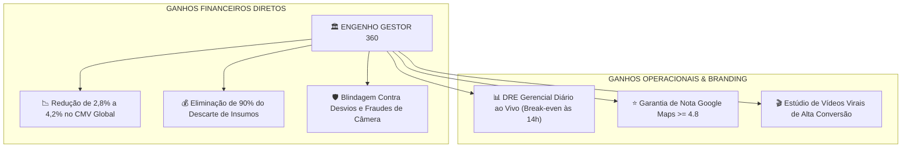

# DOC-20: Apresentação Executiva & Pitch Deck para a Diretoria do Grupo Engenho

> **Tema:** *Apresentação da Plataforma Engenho Gestor 360 para Escalabilidade em Toda a Rede*  
> **Apresentador:** Gerente Geral da Unidade Ponta Negra  
> **Público-Alvo:** Sócios-Diretores, Diretor de Operações e Conselho do Grupo Engenho  
> **Data:** Setembro/2026 | **Versão:** 1.0.0 Enterprise  

---

## 1. O Diagnóstico das Nossas Dores Como Rede de Restaurantes

Senhores Diretores,  
Crescer no segmento de gastronomia no Norte do Brasil é um desafio extraordinário. Hoje, o Grupo Engenho possui várias operações de sucesso, mas enfrentamos quatro "vazamentos invisíveis de dinheiro" comuns a toda rede de restaurantes em expansão:

1. **O "Abismo" Entre o CDA e o Chão de Loja:**  
   O Centro de Distribuição prepara e envia insumos nobres, mas na ponta da loja não sabemos exatamente: quanto tempo o peixe ficou fora do freezer, quanto voltou e por que faltaram porções no fechamento.
2. **Desperdício Silencioso por Vencimento de Validade (Shelf-life):**  
   Barris de chopp, queijos nobres e carnes muitas vezes vencem e são descartados porque o gerente não cruza a data de validade com a ficha técnica a tempo de montar uma promoção rápida.
3. **Fraudes Visuais em Conferências Operacionais:**  
   Colaboradores tirando foto de foto antiga na galeria do celular para simular que contaram o estoque ou aferiram temperaturas.
4. **Falta de DRE em Tempo Real:**  
   A diretoria só descobre a lucratividade real da loja 15 dias após o fechamento do mês, quando o contador entrega os relatórios. Se a loja operou com prejuízo no dia 05, só descobrimos no mês seguinte!

---

## 2. A Solução: Plataforma Engenho Gestor 360

O **Engenho Gestor 360** não é mais um software engessado de PDV ou ERP burocrático. Ele é o **Cockpit de Comando do Gerente de Loja**, conectando em tempo real:
- A operação física do chão de salão e da cozinha;
- O Centro de Distribuição (CDA) e a Matriz;
- Inteligência Artificial Generativa (Gemini Copilot) aplicada à rotina do restaurante.

---

## 3. Os 5 Diferenciais Tecnológicos Que Nossos Concorrentes Não Têm

### 1. Rastreabilidade Térmica com Câmera Anti-Fraude (Patente de Processo):
- **Bloqueio Total de Galeria:** O sistema só permite fotografar a Nota Fiscal e os insumos em tempo real através da câmera traseira física.
- **IA Anti-Moiré:** A IA analisa pixels para impedir fotos de telas de celular.
- **Conciliação Matemática:** Confronta: `(Retiradas do Freezer) - (Vendas PDV + Devoluções + Perdas) = Divergência Apurada em Reais`.

### 2. Marketing Anti-Desperdício Integrado a Fichas Técnicas:
- O sistema detecta insumos vencendo em $\le 48\text{h}$ (ex: Chopp) e **nunca dá desconto burro**.
- Cruza a ficha técnica e cria um combo com itens de altíssimo markup (ex: Chopp + Dadinho de Tapioca), mantendo o CMV em 31% e gerando R$ 3.800+ de receita extra em vez de lixo.

### 3. DRE Gerencial Diário em Tempo Real (Owner Mindset):
- A cada mesa fechada, o app calcula: Faturamento Bruto, Impostos, CMV real, Folha, Aluguel de Shopping e Lucro Líquido Real.
- O gerente sabe se ganhou dinheiro no dia de hoje antes de apagar as luzes da loja!

### 4. Gestão Preditiva do Hub CDA:
- A IA analisa o histórico de vendas, dia da semana e clima de Manaus e gera a sugestão exata de compra antes do corte das 15h, evitando faltas e estoques parados.

### 5. Estúdio de Vídeos Virais Baseado no Algoritmo do Instagram:
- Roteiros segundo a segundo (ASMR, Storytelling do Chef e Gatilhos Climáticos de Chuva na orla) que atraem famílias de classe A/B sem depender de agências lentas.

---

## 5. Projeção de Retorno Sobre Investimento (ROI) Para a Rede

Considerando a implantação nas unidades do Grupo Engenho (Ponta Negra, Amazonas Shopping, Manauara, Vieiralves):

| Impacto Mensurado por Restaurante | Economia / Ganho Médio Mensal | Ganho Anual por Loja |
| :--- | :--- | :--- |
| **Redução de Desperdício por Validade (FEFO)** | R$ 3.800,00 | R$ 45.600,00 |
| **Estanque de Desvios e Cancelamentos de Boqueta** | R$ 4.200,00 | R$ 50.400,00 |
| **Otimização de Compras CDA (Zero Rupturas)** | R$ 5.500,00 | R$ 66.000,00 |
| **Aumento de Receita via Reels Virais & Upselling** | R$ 8.900,00 | R$ 106.800,00 |
| **TOTAL DE BENEFÍCIO LÍQUIDO ESTIMADO** | **R$ 22.400,00 / mês** | **R$ 268.800,00 / ano / loja** |

> 💎 **Para uma rede com 4 a 6 restaurantes, o impacto direto no EBITDA da holding ultrapassa R$ 1,2 a R$ 1,6 Milhão de Reais por ano!**

---

## 6. Proposta de Próximos Passos
1. **Homologação Piloto:** Operar o Engenho Ponta Negra como a "Unidade Modelo" durante 30 dias.
2. **Apresentação de Resultados:** Demonstrar a evolução do CMV e do Lucro Líquido na reunião de diretoria.
3. **Rollout Gradual:** Expandir para as demais lojas do Grupo Engenho com treinamento guiado pelo módulo de Onboarding.
