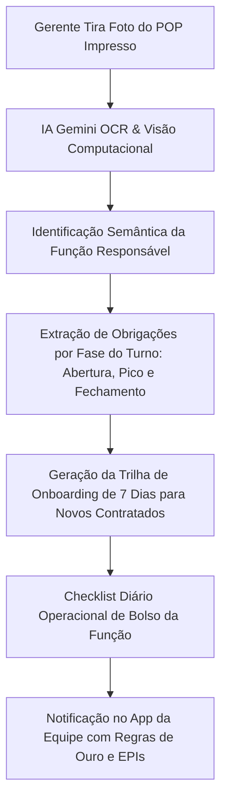

# DOC-21: Onboarding Multifunções da Brigada & Leitor Inteligente de POPs por IA

> **Engenho Gestor 360 — Unidade Shopping Ponta Negra (Manaus/AM)**  
> **Módulo:** *Staff Role-Based Onboarding & AI POP Ingestion Engine*  
> **Data:** Setembro/2026 | **Versão:** 1.0.0 Enterprise  

---

## 1. Visão Geral & O Problema do Turn-over em Restaurantes

O setor de bares e restaurantes em shoppings sofre com rotatividade (**turnover**) histórica de 40% a 70% ao ano. Quando um novo garçom, cozinheiro ou auxiliar entra:
1. **Treinamento Informal e Despadronizado:** O novato aprende observando colegas que muitas vezes já têm vícios operacionais.
2. **POPs Guardados em Pastas Físicas Empoeiradas:** Os Manuais de Procedimentos Operacionais Padrão (POPs) do Grupo Engenho existem no papel, mas ninguém lê no dia a dia da cozinha ou do salão.
3. **Falta de Clareza nas Obrigações:** O colaborador erra porque nunca teve uma lista transparente e objetiva do que é esperado dele na Abertura, no Pico e no Fechamento.

---

## 2. A Solução: Ingestão Inteligente de POPs via Foto com IA

O **Engenho Gestor 360** cria uma ponte direta entre os manuais impressos da matriz e o smartphone/tablet de cada funcionário:

### Como a IA Processa a Foto do POP:
1. **Reconhecimento Óptico de Caracteres (OCR):** Lê o texto mesmo em papel amassado ou com anotações manuais do chef.
2. **Classificação por Cargo (Role Mapping):** Identifica se o procedimento pertence ao *Garçom*, *Sous-Chef*, *Cozinheiro de Grelha*, *Bartender*, *Steward* ou *Hostess*.
3. **Quebra de Tarefas Acionáveis:** Converte parágrafos burocráticos em micro-tarefas com horário, critério de aceitação e EPIs obrigatórios.

---

## 3. Matriz de Cargos & Guias de Onboarding Prontos

Abaixo está a estrutura mestra dos 6 cargos fundamentais do Restaurante Engenho:

### 1. Garçom de Salão (Hospitalidade & Vendas)
- **Missão:** Atuar como embaixador da culinária amazônica, encantando o cliente da classe A/B e aplicando técnicas de upselling.
- **Trilha de Onboarding (Primeiros 7 Dias):**
  - *Dia 1:* Apresentação da brigada, rota de fuga, uniforme impecável e cardápio de entradas.
  - *Dia 2:* Decoração de mesas, montagem de mise-en-place e manuseio da bandeja sem balançar.
  - *Dia 3:* Domínio completo dos pratos principais (Tambaqui na Brasa, Pirarucu, Baião).
  - *Dia 4:* Harmonização básica com chopps e drinks regionais de cupuaçu/taperebá.
  - *Dia 5:* Protocolo de Mesa: Abordagem inicial em $\le 90$ segundos e retiro de pratos vazios.
  - *Dia 6:* Técnicas de upselling de sobremesas (Cartola) e cafés amazônicos.
  - *Dia 7:* Atendimento autônomo com supervisão e conferência de conta sem erros.
- **Obrigações Diárias Inegociáveis (POP):**
  - Checar se galheteiros, saleiros e pimentas estão abastecidos e limpos às 11h00.
  - Jamais deixar um cliente esperando com o braço levantado por mais de 15 segundos.
  - Repetir o pedido em voz alta antes de transmitir à cozinha.

---

### 2. Cozinheiro de Praça (Grelha & Pescados)
- **Missão:** Garantir o ponto perfeito e a suculência das carnes nobres e peixes amazônicos em $\le 18$ minutos.
- **Trilha de Onboarding:**
  - *Dia 1:* Segurança com facas, uso obrigatório de sapato antiderrapante, dólmã e rede de cabelo.
  - *Dia 2:* Padrão de corte e porcionamento da Costela de Tambaqui (400g) e lombo de Pirarucu.
  - *Dia 3:* Controle da brasa de carvão: temperatura ideal para selar sem queimar.
  - *Dia 4:* Fichas técnicas de temperos regionais (chicória, alho, limão taiti e azeite de castanha).
  - *Dia 5:* Montagem de travessas familiares com farinha de Uarini crocante.
  - *Dia 6:* Ritmo de pico: manter tempo de boqueta abaixo de 22 minutos no almoço.
  - *Dia 7:* Limpeza profunda de bancadas de inox e grelhas ao final do turno.

---

### 3. Steward / Auxiliar de Higienização (Coração Invisível)
- **Missão:** Blindar a loja contra contaminações, mantendo louças, talheres e panelas impecáveis.
- **Obrigações Diárias (POP):**
  - Troca da água da máquina de lavar louças a cada 2 horas no pico.
  - Sanitização de talheres em solução clorada a 200ppm com secagem natural (proibido usar pano).
  - Descarte seletivo do lixo orgânico sem transbordar lixeiras com tampa a pedal.

---

### 4. Bartender / Barman (Mixologia Regional & Velocidade)
- **Missão:** Entregar chopps trincando em $\le 3$ minutos e drinks artesanais amazônicos de alto padrão.
- **Obrigações Diárias (POP):**
  - Manter chopeira purgada e canecas no congelador a -12°C.
  - Checar estoque de polpas de frutas regionais (cupuaçu, graviola, taperebá, açaí).
  - Controle de perda de barris (sangria máxima permitida: 1 copo por troca de barril).

---

### 5. Hostess / Recepcionista (Primeira Impressão)
- **Missão:** Receber o cliente com sorriso caloroso em $\le 5$ segundos e gerenciar a fila de espera.
- **Obrigações Diárias (POP):**
  - Reconhecer clientes VIPs dos condomínios da Ponta Negra e avisar o gerente de imediato.
  - Manter cardápios físicos higienizados e tablet de reservas atualizado.
  - Informar tempo de espera com precisão realista (nunca mentir para reter cliente na porta).

---

### 6. Cumin / Auxiliar de Garçom (Suporte & Velocidade)
- **Missão:** Agilizar o transporte de pratos da boqueta até a mesa e garantir limpeza relâmpago.
- **Obrigações Diárias (POP):**
  - Limpar e remontar mesas desocupadas em menos de 2 minutos.
  - Transportar os pratos quentes com apoio térmico sem tocar na comida.
  - Reabastecer gelo e aparadores de serviço constantemente.

---

## 4. O Sistema de Certificação & Gamificação da Equipe

- **Medalha de Integração Concluída:** Quando o novato completa os 7 dias da trilha no app, o gerente recebe um aviso para aplicar uma rápida avaliação prática.
- **Vínculo com a Bonificação:** Unidades com 100% dos colaboradores certificados nos POPs reduzem quebras de pratos em 65% e aumentam a nota do Google Maps (NPS), garantindo os R$ 2.000,00 de bônus mensal do gerente.
