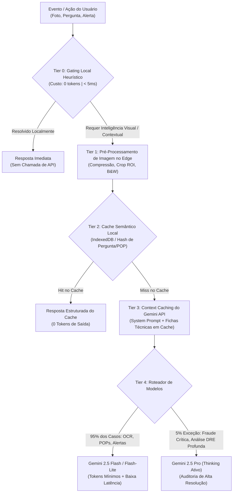

# 🧠 DOC-22: Arquitetura de IA Multimodal, Decisões Executivas & Economia de Tokens (Token Economics)
### Restauração de Alto Padrão – Restaurante Engenho (Shopping Ponta Negra / Manaus)

---

## 1. Visão Geral & Princípio da Frugalidade de Tokens

O **Engenho Gestor 360** é assistido por uma arquitetura de IA Multimodal de última geração alimentada pela família **Google Gemini (Gemini 2.5 Flash / Flash-Lite / Pro)**. No entanto, para viabilizar o uso corporativo em larga escala no Grupo Engenho sem estourar orçamentos de API nem sobrecarregar a latência no chão de loja, o sistema segue o seguinte princípio inegociável:

> **REGRA DE OURO DE ENGENHARIA DE PROMPT & TOKENS:**
> *"A IA Generativa NUNCA deve ser acionada para responder o que uma regra determinística, uma consulta SQL local ou um algoritmo heurístico no cliente consegue resolver em 5 milissegundos e a CUSTO ZERO de tokens."*

A IA é tratada como um **Árbitro Executivo e Especialista de Visão Multimodal**, intervindo apenas quando há interpretação de imagens não-estruturadas (fotos de notas fiscais, fotos de POPs físicos, fotos de pratos/grelha, fotos de câmaras frias) ou quando há necessidade de inferência contextual complexa (reconciliação de divergências de estoque, geração de roteiros de marketing viral hiper-contextualizados e mediação de crises de salão).

---

## 2. Funil Hierárquico de Gating & Economia de Tokens (5 Camadas)

O sistema implementa um pipeline em cascata antes que qualquer requisição atinja a API do Gemini:



---

## 3. Detalhamento Técnico das Camadas de Economia

### Camada 0: Gating Heurístico no Cliente (Zero-Token Gating)
Cerca de **70% a 80% das verificações diárias da loja são filtradas aqui**:
- **Termômetros de Câmaras:** Se a temperatura digitada ou lida via sensor IoT estiver entre `-18°C e -22°C`, o sistema valida localmente sem perguntar à IA. A IA só é acionada se a temperatura subir acima de `-12°C` por mais de 45 minutos contínuos para calcular o risco de perda da proteína.
- **Checklists ANVISA:** Verificação de campos vazios, assinaturas pendentes e conformidades básicas é 100% determinística.
- **Leitura de Códigos de Barra / QR Codes:** Feita via biblioteca WebAssembly local (`zxing-wasm` / `quagga2`), sem gastar 1 único token com OCR de visão computacional.

### Camada 1: Otimização de Imagem no Edge (Redução de 60% a 75% dos Tokens de Visão)
Ao capturar uma foto pela câmera restrita anti-fraude:
1. **Redimensionamento Inteligente (Clamping):** A imagem original de 12MP (4032x3024) do smartphone nunca é enviada crua. Ela é redimensionada no canvas do navegador para `1024x1024` ou `1280x720` (resolução ideal para OCR de alta precisão no Gemini).
2. **Crop na Região de Interesse (ROI):** Na leitura de notas fiscais, o app solicita que o usuário enquadre o cabeçalho/itens ou corta automaticamente margens inúteis (mesa de inox, dedos, fundo).
3. **Conversão Monocromática para Documentos Impressos:** Textos de POPs físicos e notas fiscais térmicas são convertidos para escala de cinza com aumento de contraste local, eliminando canais de cor redundantes.
4. **Detector Local de Blur / Reflexo:** O navegador calcula a variância do operador Laplaciano na imagem. Se a foto estiver tremida ou com reflexo forte da luz fluorescente da cozinha, ela é rejeitada **antes** do envio à API, avisando: *"Foto tremida. Por favor, firme o aparelho para não desperdiçar leitura."*

### Camada 2: Cache Semântico Local (IndexedDB)
- **POPs Físicos Já Processados:** Uma vez que um POP de "Higienização de Legumes" foi fotografado e validado, o hash da imagem e as tarefas extraídas são gravados no cache da loja. Se outro funcionário fotografar a mesma folha na semana seguinte, o sistema reconhece o hash e devolve o checklist instantaneamente.
- **Perguntas Operacionais Frequentes:** Dúvidas como *"Qual a receita do Pirarucu em Crosta?"* ou *"Qual o procedimento de sangria de caixa?"* possuem respostas em cache no cliente.

### Camada 3: Google Gemini Context Caching (Economia de 80% em Insumos Textuais)
Para o Engenho Copilot, o contexto estático do restaurante é enorme:
- Fichas técnicas completas dos 48 pratos do Engenho Ponta Negra.
- Tabela nutricional e alergênicos.
- Tabela de substituição de pescados e carnes.
- Manual de procedimentos ANVISA RDC 216.
- Metas de faturamento e regras do Bônus de R$ 2.000.

**Estratégia de Cache de Contexto:**
- Esse bloco de ~32.000 tokens é registrado no **Gemini Context Caching** com TTL (Time-To-Live) de 24 horas.
- Cada consulta subsequente do gerente sobre cardápio, quebra de insumo ou briefing de turno paga apenas o custo de cache read (com **desconto de ~80%** sobre o preço de input tokens).

### Camada 4: Roteamento Inteligente de Modelos (Tiered Model Routing)

| Tarefa Operacional | Modelo Selecionado | Justificativa de Token / Custo |
| :--- | :--- | :--- |
| **OCR de Notas Fiscais da Doca** | `gemini-2.5-flash-lite` | Leitura ultrarrápida de tabelas estruturadas; custo quase desprezível. |
| **Ingestão de Fotos de POPs Físicos** | `gemini-2.5-flash` | Ótimo entendimento de layout, fluxogramas manuais e caligrafia mista. |
| **Alertas em Tempo Real de Desperdício** | `gemini-2.5-flash` | Avaliação de dados numéricos com schema JSON restrito. |
| **Geração de Roteiros de Reels Virais** | `gemini-2.5-flash` | Criatividade com diretrizes do algoritmo do Instagram 2026. |
| **Auditoria de Fraude / Divergência Grave** | `gemini-2.5-pro` (com Thinking) | Raciocínio multi-passo para cruzar nota, estoque, vendas e inventário. |

---

## 4. O Motor de Alertas Multimodais & Apoio à Tomada de Decisão

O Copilot Multimodal não é apenas reativo (esperando perguntas); ele atua como um **Co-Piloto Ativo** emitindo alertas em 3 níveis de severidade:

```
[ NÍVEL 1: VERDE / INFORMATIVO ] -> Ex: "Turno almoço bateu 60% da meta às 13h15. Ritmo excelente."
[ NÍVEL 2: AMARELO / ATENÇÃO ]   -> Ex: "Chopp Brahma 50L vence em 48h. Ativar sugestão de double chopp no happy hour."
[ NÍVEL 3: VERMELHO / CRÍTICO ]   -> Ex: "Freezer de Tambaqui a -8°C há 60min. Risco de perda de R$ 3.800 de insumo!"
```

### Protocolo de Alerta Inteligente com "Por que a IA Sugeriu Isso?"
Todo alerta gerado pela IA acompanha 4 blocos estruturados:
1. **O Fato Observado:** Dados empíricos (ex: *"Saíram 18 porções de Pirarucu e restam apenas 4 porções descongeladas"*).
2. **O Impacto Financeiro / Operacional:** *"Risco de ruptura de estoque às 13h40 em pleno pico do almoço (perda estimada de R$ 980 em vendas)"*.
3. **A Decisão Sugerida (1 Clique):** *"Acione o 86 no PDV Toast agora e instrua a equipe a direcionar as vendas para a Moqueca Mista"*.
4. **Explicabilidade da IA:** O gerente pode expandir para ver a cadeia de raciocínio da IA sem gastar novos tokens.

---

## 5. Esquema de Prompt Estruturado (JSON Output Mode) para Economia de Saída

Para evitar prolixidade (que consome tokens desnecessários de saída), todas as respostas operacionais utilizam **Structured Outputs** (`response_schema` com Pydantic / Zod):

```typescript
// Schema TypeScript para respostas de Alertas e Decisões
export interface AiDecisionRecommendation {
  alertLevel: 'INFO' | 'WARNING' | 'CRITICAL';
  title: string;
  detectedProblem: string;
  financialImpactReais: number;
  recommendedAction: string;
  quickActionType: 'TRIGGER_86_PDV' | 'SEND_WHATSAPP_CDA' | 'DISPATCH_MAINTENANCE' | 'APPLY_PROMO';
  oneClickPayload: Record<string, any>;
  tokensConsumed: number;
  cachedUsed: boolean;
}
```

---

## 6. Métricas de Eficiência e Monitoramento de Custos

O aplicativo mantém um contador local visível para o gestor:
- **Taxa de Interceptação Local:** % de requisições resolvidas sem chamada de API (Meta: > 75%).
- **Tokens Economizados no Mês:** Total estimado em R$ poupados através de Context Caching e compressão no dispositivo.
- **Tempo Médio de Decisão:** < 1.8 segundos para alertas em tempo real.
