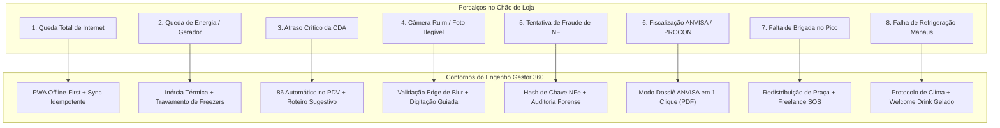

# 🛡️ DOC-23: Matriz de Percalços Operacionais, Falhas Críticas & Planos de Contorno
### Protocolos de Contingência para o Restaurante Engenho – Shopping Ponta Negra (Manaus/AM)

---

## 1. Introdução & Filosofia de Resiliência de Loja

Na operação de um restaurante de alto padrão em um grande shopping center em Manaus, a perfeição teórica é colocada à prova diariamente por imprevistos: quedas de internet, picos de calor de 38°C, atrasos na doca de shopping, instabilidade de no-break, faltas inesperadas de equipe e fiscalizações surpresa.

O **Engenho Gestor 360** foi projetado para **nunca parar**, garantindo que o gerente tenha um plano de contingência automatizado para cada um dos 8 percalços operacionais mais severos.

---

## 2. Matriz de Percalços & Soluções Sistêmicas

---

## 3. Detalhamento dos 8 Percalços & Protocolos de Ação

---

### Percalço 1: Queda Total de Link de Internet (Fibra/Wi-Fi da Loja)
- **Cenário Real:** Em dias de tempestades tropicais em Manaus, a operadora local sofre rompimento de fibra ótica. A loja fica sem internet durante o almoço de sábado.
- **Risco:** Impossibilidade de consultar fichas técnicas, enviar fotos de notas, verificar validades ou usar a IA na nuvem.
- **Plano de Contorno Tecnológico:**
  1. **Arquitetura PWA Offline-First:** Toda a interface, tabelas de estoque, fichas técnicas e checklists estão no cache do Service Worker e no banco local **IndexedDB**.
  2. **Fila de Sincronização Assíncrona (Outbox Pattern):** Se o colaborador fotografar a saída de 5 costelas de tambaqui sem conexão, a foto é gravada localmente com timestamp assinado e hash criptográfico.
  3. **Zero Interrupção no Salão:** O app continua operando normalmente. Assim que o 4G do celular do gerente ou a fibra voltar, o sistema faz o sincronismo idempotente com a nuvem sem duplicar registros.

---

### Percalço 2: Queda de Energia do Shopping / Entrada Parcial de Gerador
- **Cenário Real:** Oscilação na subestação do Shopping Ponta Negra; a energia cai e o gerador do shopping assume apenas iluminação básica e tomadas vermelhas prioritárias.
- **Risco:** Câmaras frias e ar-condicionado desligados; risco iminente de perda de R$ 45.000 em pescados e carnes nobres.
- **Plano de Contorno Operacional & Sistêmico:**
  1. **Protocolo de Inércia Térmica:** O app emite alarme sonoro para a cozinha: *"BLOQUEAR ABERTURA DE FREEZERS E CÂMARAS"*. Freezers industriais mantêm a temperatura abaixo de -5°C por até 6 horas se as portas não forem abertas.
  2. **Monitoramento de Bateria dos No-Breaks:** O app calcula a autonomia dos no-breaks dos computadores fiscais (PDV) e orienta desligar telas não essenciais para estender o tempo para 90 minutos.
  3. **Plano de Conexão Crítica:** O roteador principal é mantido no no-break do escritório com modem 4G de failover automático.

---

### Percalço 3: Ruptura ou Atraso Crítico do Caminhão da CDA (Distribuição)
- **Cenário Real:** A balsa ou o caminhão refrigerado da CDA fica preso no trânsito da Avenida Coronel Teixeira ou sofre avaria. Chegam 12h00 e o Tambaqui do almoço não foi entregue.
- **Risco:** Decepcionar clientes que vão ao Engenho exatamente para comer a Costela de Tambaqui, gerando cancelamentos e atritos.
- **Plano de Contorno Gastronômico & Comercial:**
  1. **Acionamento do "Item 86" (Esgotado) no PDV Toast:** Com 1 clique no app, o item é pausado no cardápio digital, impedindo que os garçons lancem novos pedidos.
  2. **Script de Venda Sugestiva Alternativa:** A IA gera instantaneamente uma orientação verbal para o briefing do salão:
     > *"Pessoal, nosso Tambaqui está chegando na doca, então vamos direcionar 100% das mesas para o nosso Pirarucu em Crosta de Castanha ou para a Carne de Sol de Bragança. Ambos têm margem excelente e saída rápida!"*
  3. **Compensação de Margem:** Como a Carne de Sol tem CMV ligeiramente inferior (27% vs. 31% do Tambaqui), a rentabilidade do turno é protegida.

---

### Percalço 4: Câmera com Reflexo, Gordura ou Foto Ilegível de POP / Nota Fiscal
- **Cenário Real:** Na cozinha quente e úmida, a lente do celular fica embaçada com vapor de gordura ou a luz fluorescente reflete no papel térmico brilhante da nota fiscal.
- **Risco:** Erro no OCR, leitura de CNPJ incorreto ou alucinação de valores.
- **Plano de Contorno de Visão Computacional no Edge:**
  1. **Detector Local de Nitidez (Laplacian Variance):** Se o score de nitidez for inferior a `100.0`, o app **NÃO consome a API do Gemini**. Ele exibe um alerta na tela: *"Lente embaçada ou foto tremida. Limpe a câmera e firme o celular"*.
  2. **Detector de Superexposição (Glare Filter):** Se 15% ou mais dos pixels da área do texto estiverem saturados de branco (reflexo de lâmpada), o app orienta inclinar o documento em 15 graus.
  3. **Fallback Guiado de 3 Campos:** Se após 2 tentativas a leitura ótica falhar, o app abre um formulário simplificado para o gerente digitar apenas: Número da Nota, Fornecedor e Valor Total, agendando a foto para reprocessamento posterior.

---

### Percalço 5: Tentativa de Fraude de Estoque ou Reciclagem de Nota Fiscal
- **Cenário Real:** Um colaborador desonesto tenta fotografar a nota fiscal do dia anterior para justificar o desvio de uma caixa de camarão ou garrafas de uísque.
- **Risco:** Prejuízo financeiro direto no CMV e quebra de estoque fantasma.
- **Plano de Contorno Anti-Fraude com IA:**
  1. **Hash Único da Imagem e Chave NFe:** Ao fotografar a nota, o sistema extrai a chave de 44 dígitos da NF-e e gera o hash SHA-256 do arquivo. Se a nota já tiver sido registrada nos últimos 60 dias, o sistema emite: *"ALERTA DE SEGURANÇA: Esta nota fiscal já foi liquidada em 09/09/2026 às 11:30"*.
  2. **Detecção de "Foto de Tela" (Moiré Pattern):** A IA identifica se o colaborador está fotografando a tela de outro celular ou computador (padrão de grade de pixels/Moiré). Caso detectado, a foto é bloqueada e um aviso silencioso é enviado ao Gerente Geral.
  3. **Conferência Cega Obrigatória na Doca:** O conferente digita o que contou fisicamente antes de ver o que a nota declara. Divergências > 2% exigem liberação com biometria ou PIN do gerente.

---

### Percalço 6: Fiscalização Surpresa da Vigilância Sanitária (ANVISA Manaus) / PROCON
- **Cenário Real:** Às 11h15 da manhã de uma terça-feira, dois fiscais da Vigilância Sanitária municipal entram no restaurante para inspeção de rotina.
- **Risco:** Fiscais encontrarem fichas de temperatura em papel incompletas ou faltarem laudos técnicos, resultando em autos de infração e multas pesadas.
- **Plano de Contorno "Modo Auditoria ANVISA" (1 Clique):**
  1. **Painel de Fiscalização Imediato:** O gerente clica no botão `[ 🛡️ Modo ANVISA ]` no app.
  2. **Dossiê Digital Instantâneo (Exportação em PDF ABNT):**
     - Histórico de 90 dias de temperaturas de câmaras e balcões refrigerados (com horários das 10h e 16h).
     - Comprovante de coleta e destinação de óleo saturado (empresa licenciada).
     - Certificado de desinsetização e desratização da unidade Shopping Ponta Negra dentro da validade.
     - ASO (Atestado de Saúde Ocupacional) de todos os manipuladores de alimentos.
     - Rastreabilidade dos lotes de pescados com SIF e data de descongelação.
  3. **Efeito Psicológico Positivo:** Apresentar a documentação organizada em um tablet causa forte impressão de governança profissional, desarmando o fiscal e agilizando a vistoria.

---

### Percalço 7: Falta Inesperada de Colaboradores em Dia de Pico (Domingo)
- **Cenário Real:** Dois garçons e um cozinheiro de grelha passam mal e não comparecem no almoço de Dia das Mães ou domingo de chuva intensa.
- **Risco:** Sobrecarga dos demais colaboradores, tempo de mesa explodindo para 35 minutos e notas de 1 estrela no Google Meu Negócio.
- **Plano de Contorno Operacional & Gestão de Pessoas:**
  1. **Readequação Automática de Praças:** O app redistribui as 36 mesas do salão entre os garçons presentes, ajustando as metas individuais para não desmotivar quem veio trabalhar.
  2. **Banco de Talentos Emergencial (Freelances Homologados):** Com 1 toque, o gerente envia convocação via WhatsApp para 5 profissionais pré-treinados e homologados pelo Grupo Engenho com diária pré-aprovada.
  3. **Simplificação Temporária do Menu de Acompanhamentos:** O Chef Executivo recebe sinalização no tablet da cozinha para priorizar guarnições de montagem rápida (arroz de jambu, farofa de banana pacovã e mandioca cozida), pausando pratos com guarnições excessivamente trabalhosas.

---

### Percalço 8: Climatização / Instabilidade do Ar-Condicionado (Manaus 38°C)
- **Cenário Real:** Um dos compressores do fancoil da praça de alimentação ou da loja desarma. A temperatura do salão sobe de 22°C para 27°C no meio da tarde.
- **Risco:** Clientes incomodados pedem a conta mais cedo, recusam vinhos tintos e sobremesas quentes, gerando queda no ticket médio.
- **Plano de Contorno de Hospitalidade:**
  1. **Acionamento Imediato da Engenharia do Shopping:** O app fornece o contato direto do plantonista do Shopping Ponta Negra para chamado prioritário de refrigeração.
  2. **Estratégia de Hospitalidade Amenizadora:**
     - Garçons servem gratuitamente cortesias de **Água Mineral Aromatizada com Capim-Santo e Limão Siciliano bem gelada** em todas as mesas.
     - Promoção do Copilot: Sugestão de **Sorvetes Artesanais de Castanha e Cupuaçu** e **Chopp Brahma em Tulipa Congelada** a preço promocional, transformando um ponto de atrito em experiência memorável.

---

## 4. Resumo de Resiliência

Com esse catálogo detalhado de contingências, o **Engenho Gestor 360** não é apenas um sistema de lançamento de dados: ele é a **blindagem operacional do restaurante**, transformando incidentes potencialmente desastrosos em processos controlados, auditados e resolvidos em minutos.
