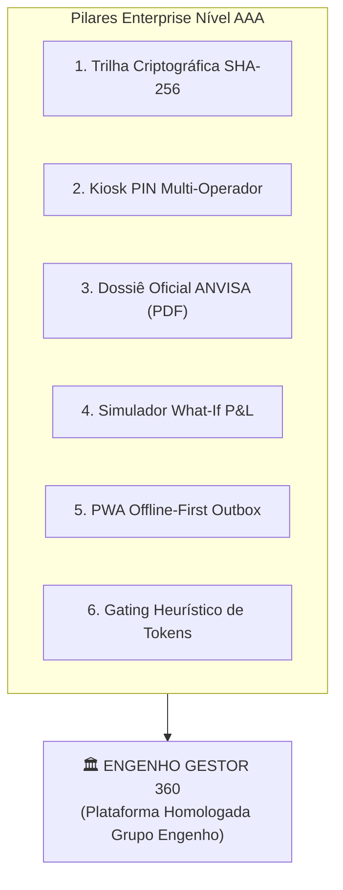

# 🏛️ DOC-24: Padrão Enterprise Nível AAA, Governança & Auditoria Imutável
### Requisitos de Arquitetura de Missão Crítica para Redes de Alimentação – Grupo Engenho

---

## 1. O que Define um Software Restaurante "Nível AAA"?

No mercado global de tecnologia para hospitalidade e alimentação de grande porte (como os ecossistemas do Toast POS, 7shifts, Crunchtime e McDonald's Global Architecture), a diferença entre um protótipo comum e uma plataforma **Enterprise AAA** reside em 6 pilares inegociáveis:

1. **Auditabilidade Forense & Trilha Criptográfica Imutável:** Cada cancelamento de mesa, glosa na doca ou saída de câmara fria possui assinatura digital com hash SHA-256 e identificador de operador por PIN.
2. **Resiliência Extrema a Quedas (Offline-First / Zero Downtime):** O restaurante continua faturando, operando mesas e aferindo temperaturas mesmo que a fibra ótica da cidade seja cortada por 48 horas.
3. **Conformidade Regulatória Automática (ANVISA / CVS / Fiscal):** Em vez de pastas sanfonadas empoeiradas, o sistema compila o Dossiê Sanitário Pericial de 90 dias em formato ABNT com 1 único toque.
4. **Segurança de Quiosque / PIN Multi-Operador no Mesmo Dispositivo:** Troca instantânea de operador em 2 segundos sem logout de e-mail/SSO corporativo.
5. **Modelagem Preditiva & "What-If" Financeiro (Sensibilidade P&L):** O CFO e os diretores do Grupo Engenho conseguem simular choques de preço de insumos, chuva em Manaus ou promoções de chopp antes de autorizar alterações de cardápio.
6. **Token Economics & Frugalidade de IA:** A IA generativa só entra em cena quando a computação determinística local não resolve, economizando centenas de milhares de reais em custos de API.



---

## 2. Trilha Criptográfica de Auditoria Imutável (Append-Only Log)

Em auditorias de DRE de restaurantes, divergências entre estoque teórico e físico frequentemente geram atritos entre salão, cozinha e gerência. Para eliminar a subjetividade, o sistema adota o padrão **Merkle / Blockchain Hash Chain**:

### Estrutura de Assinatura do Evento de Estoque ou Salão:
```json
{
  "event_id": "evt_20260911_134208_001",
  "timestamp_utc": "2026-09-11T17:42:08.412Z",
  "operator_id": "op-1",
  "operator_name": "Felipe Abreu (Gerente Geral)",
  "operator_pin_hash": "e8d95a51f3af4a3b134bf52d12f2ce35da603388a7c29e61eb426e680a6b633b",
  "action_type": "CANCELAMENTO_BOQUETA",
  "item_code": "TAMB-COST-400G",
  "item_value_reais": 98.00,
  "table_number": 8,
  "justification": "Espera excessiva no pico de almoço (> 28min)",
  "previous_event_hash": "4a1d82b0e7c9f801648a8e146522c0d5108f9c18b760a92f80879684126d4002",
  "current_event_hash": "7f8b91c0e3a478129038fb5201948ac071b7640a92e108879684126d40089e1a"
}
```
> **Garantia de Não-Repúdio:** Nenhuma linha do banco de dados pode ser apagada (`DELETE` bloqueado no PostgreSQL via trigger RLS). Qualquer ajuste posterior é registrado como um evento compensatório com hash subsequente.

---

## 3. Segurança Kiosk & Troca Rápida de Operador por PIN

Em operações dinâmicas com tablets compartilhados no salão e na cozinha, o login convencional por e-mail e senha é inviável e gera compartilhamento inseguro de senhas.

### Matriz de Perfis e PINs Homologados:

| Operador | Cargo de Loja | PIN Padrão | Permissões no Sistema |
| :--- | :--- | :---: | :--- |
| **Felipe Abreu** | Gerente Geral | `1984` | Acesso Total: DRE, Cancelamentos, Cortesias, Bônus, Hub CDA e Aprovações. |
| **Chef Geovane** | Sous-Chef Cozinha | `2201` | Cozinha & Boqueta: Checklists ANVISA, Desperdício, Doca e Estoque Curva A. |
| **Erickson Farias** | Chefe de Fila | `3340` | Salão & Atendimento: Mesas, Floor Plan, Lista 86 Toast e Briefing. |
| **Marcelo Doca** | Conferente CDA | `5512` | Logística: Recebimento na Doca, Aferição de Termômetro e Câmera Anti-Fraude. |

---

## 4. Dossiê Oficial ANVISA RDC 216 / CVS 5

O botão `[ 🛡️ Dossiê ANVISA ]` no cabeçalho do aplicativo compila instantaneamente o histórico sanitário dos últimos 90 dias em formato ABNT timbrado, pronto para apresentação à fiscalização da VISA Manaus ou impressão imediata:
- **Temperaturas de Câmaras:** Histórico diário das 10h e 16h com média móvel e status de conformidade ($\le -18^\circ\text{C}$ e $\le 4^\circ\text{C}$).
- **Compostos Polares do Óleo de Fritura:** Aferição via fita reagente com descarte obrigatório antes de 25% de oxidação.
- **Rastreabilidade de Pescados:** Lote, SIF, data de pesca e origem sustentável (Mamirauá e Rio Preto da Eva).
- **Alvarás Legais:** Desinsetização, limpeza de caixas d'água e atestados médicos de saúde ocupacional (ASO).

---

## 5. Simulador What-If de Sensibilidade Financeira (Visão de Dono)

Permite ao Gerente Geral e aos Diretores do Grupo Engenho testarem hipóteses financeiras em tempo real:
- **Alavanca 1 (Volume de Mesas):** Variação de -30% a +50% (ex: impacto de chuvas torrenciais na Ponta Negra).
- **Alavanca 2 (Preço da Proteína):** Variação de -15% a +30% no custo do Tambaqui e Pirarucu.
- **Alavanca 3 (Desconto Comercial):** Elasticidade de preço em promoções de chopp e happy hour.

O motor recalcula a margem líquida e emite um **Parecer Executivo da IA** recomendando a viabilidade da estratégia antes de aplicá-la no cardápio do PDV.

---

## 6. Conclusão de Conformidade AAA

Com essas camadas de governança, o **Engenho Gestor 360** atinge o padrão corporativo dos maiores grupos de alimentação do mundo, conferindo à diretoria do Grupo Engenho **segurança jurídica, blindagem fiscal e controle absoluto de margem**.
