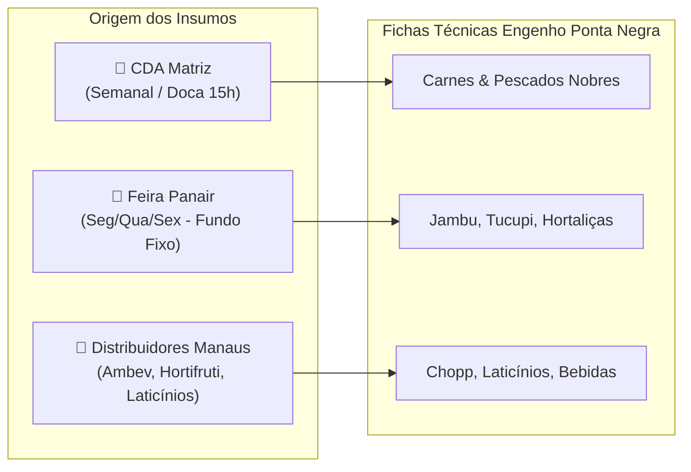

# 🍽️ DOC-25: Cardápio Oficial, Fichas Técnicas & Matriz de Insumos
### Engenharia de Cardápio, Controle de CMV e Padronização de Porções – Unidade Shopping Ponta Negra (Manaus/AM)

---

## 1. Contexto Gastronômico & Operacional do Restaurante Engenho Ponta Negra

O **Restaurante Engenho Cozinha Brasileira – Unidade Shopping Ponta Negra** combina a culinária regional amazônica com a alta gastronomia sertaneja e brasileira contemporânea. 

Para assegurar consistência de sabor, margem de contribuição saudável e proteção do CMV (*Custo de Mercadoria Vendida*), todos os pratos operam sob **Fichas Técnicas Homologadas**.

### Cadeia de Suprimentos & Abastecimento Tripartido:
1. **CDA Matriz (Centro de Distribuição Amazonas):** Fornecimento centralizado de carnes de corte nobre (picanha, filé mignon, carne de sol embalada a vácuo), pescados congelados com SIF (lombo de tambaqui, filé de pirarucu de manejo), secos e empacotados (arroz arbóreo, queijo coalho de primeira linha, farinha Uarini ovinha).
2. **Feira da Panair / Produtores Locais (Fundo Fixo / Adiantamento de Gerente):** Compra diária ou trissemanal de hortaliças amazônicas frescas que perdem qualidade se congeladas (jambu fresco, chicória-do-pará, cheiro-verde, pimenta-de-cheiro e tucupi artesanal filtrado).
3. **Distribuidores Locais Homologados em Manaus:** Laticínios frescos (creme de leite fresco, requeijão), citros (limão taiti e siciliano), bebidas em comodato (Chopp Brahma em barril, destilados, refrigerantes Ambev/Coca-Cola).

---

## 2. Engenharia de Cardápio & Metas de CMV

```mermaid
quadrantChart
    title Engenharia de Cardápio do Engenho Ponta Negra (Matriz BCG Gastronômica)
    x-axis Baixo Volume / Saída --> Alto Volume / Vendas
    y-axis Baixa Margem de Contribuição --> Alta Margem de Contribuição
    quadrant-1 ESTRELAS (Promover & Proteger)
    quadrant-2 QUEBRA-CABEÇAS (Trabalhar Vendas)
    quadrant-3 CÃES (Reformular ou Retirar)
    quadrant-4 CAVALOS DE BATALHA (Otimizar Insumos)
    "Costela de Tambaqui na Brasa": [0.85, 0.65]
    "Dadinhos de Tapioca c/ Melado": [0.92, 0.90]
    "Pirarucu em Crosta de Castanha": [0.72, 0.78]
    "Carne de Sol de Bragança": [0.78, 0.60]
    "Picanha Nobre do Engenho": [0.88, 0.52]
    "Caipirinha Jambu Treme-Treme": [0.95, 0.92]
    "Cartola Amazônica": [0.68, 0.85]
    "Moqueca Mista Amazônica": [0.55, 0.68]
    "Carpaccio de Pirarucu Defumado": [0.35, 0.70]
```

### Metas Corporativas de CMV por Categoria:
| Categoria | Meta de CMV | CMV Médio Real Atual | Margem Bruta Alvo | Tempo Médio de Boqueta |
| :--- | :---: | :---: | :---: | :---: |
| **Pescados Nobres da Amazônia** | ≤ 31.0% | 28.9% | 71.1% | 18 a 24 min |
| **Carnes Nobres & Brasa** | ≤ 31.5% | 29.2% | 70.8% | 16 a 25 min |
| **Entradas & Petiscos de Boteco** | ≤ 21.0% | 18.2% | 81.8% | 10 a 14 min |
| **Sobremesas do Engenho** | ≤ 19.0% | 17.5% | 82.5% | 8 a 10 min |
| **Bebidas, Chopp & Drinks Regionais** | ≤ 23.0% | 19.8% | 80.2% | 4 a 6 min |

---

## 3. Catálogo Oficial dos 18 Pratos Homologados

### 🐟 Categoria 1: Pescados Nobres da Amazônia

#### 1. Costela de Tambaqui na Brasa
- **Código:** `dish-01` | **Preço de Venda:** R$ 98,00 | **Custo Insumos:** R$ 29,50 | **CMV:** 30,1% | **Tempo Boqueta:** 22 min | **Peso:** 550g
- **Alérgenos:** Peixe, Glúten.
- **Composição de Insumos:**
  - Lombo de Tambaqui Nobre com Osso: 400g (R$ 20,80) – *CDA Matriz*
  - Farinha do Uarini Ovinha (Torrada na Manteiga): 80g (R$ 2,00) – *CDA Matriz*
  - Manteiga de Garrafa Artesanal: 25ml (R$ 1,20) – *CDA Matriz*
  - Tomate e Cebola Roxa (Vinagrete Regional): 70g (R$ 1,05) – *Feira Panair*
  - Cheiro-Verde e Chicória da Amazônia: 15g (R$ 0,45) – *Feira Panair*
  - Arroz Parboilizado Especial: 120g (R$ 0,96) – *CDA Matriz*
  - Limão Taiti e Sal de Parrilla: 30g (R$ 0,36) – *Distribuidor Local*
  - Embalagem e Carvão (Rateio Operacional): 1 porção (R$ 2,68) – *Distribuidor Local*

#### 2. Pirarucu em Crosta de Castanha-do-Brasil
- **Código:** `dish-02` | **Preço de Venda:** R$ 112,00 | **Custo Insumos:** R$ 31,90 | **CMV:** 28,5% | **Tempo Boqueta:** 18 min | **Peso:** 480g
- **Alérgenos:** Peixe, Castanhas/Nozes, Leite/Lactose.
- **Composição de Insumos:**
  - Filé Alto de Pirarucu de Manejo: 300g (R$ 20,40) – *CDA Matriz*
  - Castanha-do-Pará Laminada e Triturada: 50g (R$ 4,25) – *CDA Matriz*
  - Arroz Arbóreo Italiano (Base Risoto): 90g (R$ 1,98) – *CDA Matriz*
  - Tucupi Amarelo Temperado Artesanal: 120ml (R$ 1,80) – *Feira Panair*
  - Folhas de Jambu Fresco: 40g (R$ 1,00) – *Feira Panair*
  - Queijo Parmesão Ralado de Alta Cura: 25g (R$ 1,88) – *CDA Matriz*
  - Manteiga sem Sal e Azeite de Oliva: 20g (R$ 0,59) – *CDA Matriz*

#### 3. Pirarucu Ribeirinho ao Molho de Camarão & Tucupi
- **Código:** `dish-03` | **Preço de Venda:** R$ 118,00 | **Custo Insumos:** R$ 34,20 | **CMV:** 29,0% | **Tempo Boqueta:** 20 min | **Peso:** 520g
- **Alérgenos:** Peixe, Frutos do Mar/Crustáceos, Leite.
- **Composição de Insumos:**
  - Filé de Pirarucu Fresco de Manejo: 280g (R$ 19,04) – *CDA Matriz*
  - Camarão Regional Descascado e Limpo: 80g (R$ 7,60) – *CDA Matriz*
  - Tucupi Amarelo Filtrado Especial: 150ml (R$ 2,25) – *Feira Panair*
  - Leite de Coco Artesanal: 60ml (R$ 1,32) – *CDA Matriz*
  - Folhas de Jambu Fresco Cozido: 35g (R$ 0,88) – *Feira Panair*
  - Arroz Branco com Castanha Laminada: 120g (R$ 1,95) – *CDA Matriz*
  - Pimenta-de-Cheiro e Chicória: 20g (R$ 1,16) – *Feira Panair*

#### 4. Moqueca Mista Amazônica (Tambaqui & Pirarucu)
- **Código:** `dish-04` | **Preço de Venda:** R$ 138,00 | **Custo Insumos:** R$ 38,50 | **CMV:** 27,9% | **Tempo Boqueta:** 24 min | **Peso:** 750g
- **Alérgenos:** Peixe, Crustáceos.
- **Composição de Insumos:**
  - Postas de Tambaqui Selecionadas: 250g (R$ 13,00) – *CDA Matriz*
  - Cubos Altos de Pirarucu: 200g (R$ 13,60) – *CDA Matriz*
  - Azeite de Dendê Baiano Puro: 30ml (R$ 1,20) – *CDA Matriz*
  - Leite de Coco Concentrado: 150ml (R$ 3,30) – *CDA Matriz*
  - Pimentões Coloridos (Amarelo e Vermelho): 100g (R$ 2,10) – *Distribuidor Local*
  - Cebola Branca e Tomate Maduro: 100g (R$ 1,40) – *Distribuidor Local*
  - Farinha de Mandioca Branca (Pirão): 70g (R$ 0,84) – *Feira Panair*
  - Coentro, Chicória e Pimenta-de-Cheiro: 25g (R$ 0,75) – *Feira Panair*
  - Arroz Branco Soltinho: 150g (R$ 2,31) – *CDA Matriz*

#### 5. Carpaccio de Pirarucu Defumado do Chef
- **Código:** `dish-05` | **Preço de Venda:** R$ 64,00 | **Custo Insumos:** R$ 17,40 | **CMV:** 27,2% | **Tempo Boqueta:** 10 min | **Peso:** 180g
- **Alérgenos:** Peixe, Castanhas, Leite.
- **Composição de Insumos:**
  - Carpaccio de Pirarucu Curado e Defumado: 120g (R$ 11,40) – *CDA Matriz*
  - Azeite de Oliva Extra Virgem com Ervas: 25ml (R$ 1,75) – *CDA Matriz*
  - Raspas de Castanha-do-Pará Fresca: 20g (R$ 1,70) – *CDA Matriz*
  - Queijo Marajó Tipo Creme / Crostini: 30g (R$ 1,65) – *CDA Matriz*
  - Alcaparras em Conserva e Flor de Sal: 10g (R$ 0,90) – *Distribuidor Local*

---

### 🥩 Categoria 2: Carnes Nobres & Tradição da Brasa

#### 6. Carne de Sol de Bragança com Pirão de Queijo Coalho
- **Código:** `dish-06` | **Preço de Venda:** R$ 94,00 | **Custo Insumos:** R$ 27,80 | **CMV:** 29,6% | **Tempo Boqueta:** 18 min | **Peso:** 580g
- **Alérgenos:** Leite/Lactose.
- **Composição de Insumos:**
  - Carne de Sol de Bragança (Alcatra / Coxão Mole Curado): 350g (R$ 18,20) – *CDA Matriz*
  - Queijo Coalho Artesanal em Cubos: 100g (R$ 4,60) – *CDA Matriz*
  - Leite Integral Pasteurizado: 120ml (R$ 0,72) – *Distribuidor Local*
  - Farinha de Macaxeira Fina (Pirão): 50g (R$ 0,60) – *Feira Panair*
  - Manteiga de Garrafa do Sertão: 30ml (R$ 1,44) – *CDA Matriz*
  - Cebola Roxa Julienne Grelhada: 80g (R$ 1,12) – *Distribuidor Local*
  - Feijão Fradinho / Macassar Temperado: 100g (R$ 1,12) – *CDA Matriz*

#### 7. Picanha Nobre do Engenho na Chapa
- **Código:** `dish-07` | **Preço de Venda:** R$ 136,00 | **Custo Insumos:** R$ 41,20 | **CMV:** 30,3% | **Tempo Boqueta:** 20 min | **Peso:** 650g
- **Alérgenos:** Leite, Glúten.
- **Composição de Insumos:**
  - Picanha Bovina Grill Resfriada: 450g (R$ 31,50) – *CDA Matriz*
  - Queijo Coalho Grelhado no Espeto: 80g (R$ 3,68) – *CDA Matriz*
  - Macaxeira Frita Crocante: 150g (R$ 1,65) – *Feira Panair*
  - Farofa de Ovos com Cebolinha: 80g (R$ 1,68) – *CDA Matriz*
  - Vinagrete Regional e Chimichurri: 70g (R$ 1,20) – *Distribuidor Local*
  - Sal Grosso Entrefino de Parrilla: 15g (R$ 1,49) – *CDA Matriz*

#### 8. Medalhão de Filé Mignon ao Demi-Glace com Risoto de Cogumelos
- **Código:** `dish-08` | **Preço de Venda:** R$ 108,00 | **Custo Insumos:** R$ 31,50 | **CMV:** 29,2% | **Tempo Boqueta:** 16 min | **Peso:** 460g
- **Alérgenos:** Leite/Lactose.
- **Composição de Insumos:**
  - Medalhão de Filé Mignon Limpo: 250g (R$ 20,50) – *CDA Matriz*
  - Bacon em Tiras Defumado: 30g (R$ 1,35) – *CDA Matriz*
  - Fundo Demi-Glace Artesanal Reduzido: 60ml (R$ 3,00) – *CDA Matriz*
  - Arroz Arbóreo: 80g (R$ 1,76) – *CDA Matriz*
  - Cogumelos Paris e Shimeji Frescos: 60g (R$ 3,12) – *Distribuidor Local*
  - Manteiga e Vinho Tinto Seco: 30ml (R$ 1,77) – *CDA Matriz*

#### 9. Feijoada Tradicional do Engenho (Completa)
- **Código:** `dish-09` | **Preço de Venda:** R$ 86,00 | **Custo Insumos:** R$ 23,80 | **CMV:** 27,7% | **Tempo Boqueta:** 12 min | **Peso:** 680g
- **Alérgenos:** Carne Suína, Glúten.
- **Composição de Insumos:**
  - Mix de Carnes Nobres (Costelinha, Paio, Calabresa, Carne Seca, Lombo): 300g (R$ 14,40) – *CDA Matriz*
  - Feijão Preto Selecionado Tipo 1: 120g (R$ 1,44) – *CDA Matriz*
  - Couve Manteiga Refogada no Alho: 80g (R$ 1,20) – *Feira Panair*
  - Torresmo Pipoca Pururucado: 50g (R$ 2,25) – *CDA Matriz*
  - Farofa Crocante de Bacon: 70g (R$ 1,47) – *CDA Matriz*
  - Laranja Bahia Fatiada e Arroz Branco: 150g (R$ 1,65) – *Distribuidor Local*
  - Molho de Pimenta Malagueta da Casa: 20ml (R$ 1,39) – *Feira Panair*

---

### 🥟 Categoria 3: Entradas & Petiscos de Boteco

#### 10. Dadinhos de Tapioca com Geléia de Pimenta e Melado de Cupuaçu
- **Código:** `dish-10` | **Preço de Venda:** R$ 42,00 | **Custo Insumos:** R$ 7,90 | **CMV:** 18,8% | **Tempo Boqueta:** 10 min | **Peso:** 320g
- **Alérgenos:** Leite/Lactose.
- **Composição de Insumos:**
  - Tapioca Granulada: 120g (R$ 1,68) – *CDA Matriz*
  - Queijo Coalho de Primeira Qualidade Ralado: 120g (R$ 4,80) – *CDA Matriz*
  - Leite Integral Aquecido: 180ml (R$ 1,08) – *Distribuidor Local*
  - Melado de Cana com Polpa de Cupuaçu e Pimenta Dedo-de-Moça: 40g (R$ 0,34) – *Feira Panair*

#### 11. Bolinho de Macaxeira com Queijo Coalho e Carne Seca (6 unidades)
- **Código:** `dish-11` | **Preço de Venda:** R$ 46,00 | **Custo Insumos:** R$ 9,20 | **CMV:** 20,0% | **Tempo Boqueta:** 12 min | **Peso:** 300g
- **Alérgenos:** Leite, Glúten.
- **Composição de Insumos:**
  - Macaxeira Regional Cozida e Amassada: 180g (R$ 1,80) – *Feira Panair*
  - Carne Seca Desfiada e Puxada na Cebola Roxa: 80g (R$ 4,16) – *CDA Matriz*
  - Queijo Coalho em Cubos para Recheio: 40g (R$ 1,60) – *CDA Matriz*
  - Farinha Panko e Ovos para Empanar: 40g (R$ 1,04) – *CDA Matriz*
  - Maionese Caseira de Coentro e Chicória: 30g (R$ 0,60) – *Feira Panair*

#### 12. Meladinho de Minas (Queijo Canastra Grelhado com Melado de Cana)
- **Código:** `dish-12` | **Preço de Venda:** R$ 48,00 | **Custo Insumos:** R$ 10,80 | **CMV:** 22,5% | **Tempo Boqueta:** 8 min | **Peso:** 240g
- **Alérgenos:** Leite.
- **Composição de Insumos:**
  - Queijo Meia Cura / Coalho Padrão Ouro: 180g (R$ 8,28) – *CDA Matriz*
  - Melado de Cana Artesanal Puro: 40ml (R$ 1,32) – *CDA Matriz*
  - Pimenta-Biquinho Agridoce e Alecrim: 15g (R$ 1,20) – *Distribuidor Local*

#### 13. Caldo Acacat do Norte (Caldinho de Feijão com Macaxeira e Charque)
- **Código:** `dish-13` | **Preço de Venda:** R$ 26,00 | **Custo Insumos:** R$ 4,60 | **CMV:** 17,7% | **Tempo Boqueta:** 6 min | **Peso:** 280ml
- **Alérgenos:** Carne Bovina.
- **Composição de Insumos:**
  - Caldo Concentrado de Feijão Fradinho com Macaxeira: 250ml (R$ 2,00) – *Feira Panair*
  - Charque Bovino Desfiado e Frito: 30g (R$ 1,56) – *CDA Matriz*
  - Cheiro-Verde, Alho Dourado e Pimenta-de-Cheiro: 10g (R$ 0,45) – *Feira Panair*
  - Torradinhas de Pão Francês com Ervas: 20g (R$ 0,59) – *Distribuidor Local*

---

### 🍨 Categoria 4: Sobremesas do Engenho

#### 14. Cartola Amazônica na Chapa
- **Código:** `dish-14` | **Preço de Venda:** R$ 34,00 | **Custo Insumos:** R$ 6,20 | **CMV:** 18,2% | **Tempo Boqueta:** 8 min | **Peso:** 220g
- **Alérgenos:** Leite/Lactose.
- **Composição de Insumos:**
  - Banana Pacovã Frita na Manteiga: 120g (R$ 1,44) – *Feira Panair*
  - Queijo Coalho Grelhado Derretido: 80g (R$ 3,20) – *CDA Matriz*
  - Açúcar Mascavo, Canela e Castanha Triturada: 15g (R$ 0,76) – *CDA Matriz*
  - Manteiga Clarificada: 15g (R$ 0,80) – *CDA Matriz*

#### 15. Mousse Cremosa de Cupuaçu com Ganache de Cacau 70%
- **Código:** `dish-15` | **Preço de Venda:** R$ 29,00 | **Custo Insumos:** R$ 5,10 | **CMV:** 17,6% | **Tempo Boqueta:** 5 min | **Peso:** 160g
- **Alérgenos:** Leite/Lactose.
- **Composição de Insumos:**
  - Polpa Pura de Cupuaçu Artesanal: 80g (R$ 1,60) – *Feira Panair*
  - Leite Condensado e Creme de Leite UHT: 60g (R$ 1,50) – *CDA Matriz*
  - Chocolate Meio Amargo 70% Cacau da Amazônia: 30g (R$ 1,50) – *CDA Matriz*
  - Nibs de Cacau e Castanha Ralada para Finalização: 10g (R$ 0,50) – *CDA Matriz*

#### 16. Petit Gâteau com Sorvete Artesanal de Castanha-do-Pará
- **Código:** `dish-16` | **Preço de Venda:** R$ 36,00 | **Custo Insumos:** R$ 6,80 | **CMV:** 18,9% | **Tempo Boqueta:** 10 min | **Peso:** 190g
- **Alérgenos:** Glúten, Ovos, Leite, Castanhas.
- **Composição de Insumos:**
  - Petit Gâteau de Chocolate Belga Congelado Homologado: 1 un (R$ 3,40) – *CDA Matriz*
  - Bola de Sorvete de Castanha-do-Pará: 80g (R$ 2,24) – *Distribuidor Local*
  - Calda Quente de Chocolate e Hortelã Fresca: 20g (R$ 1,16) – *CDA Matriz*

---

### 🍹 Categoria 5: Bebidas, Chopp & Coquetelaria Regional

#### 17. Caipirinha Engenho Jambu Treme-Treme
- **Código:** `dish-17` | **Preço de Venda:** R$ 32,00 | **Custo Insumos:** R$ 6,40 | **CMV:** 20,0% | **Tempo Boqueta:** 4 min | **Volume:** 300ml
- **Composição de Insumos:**
  - Cachaça de Jambu Meu Garoto (Original): 60ml (R$ 3,90) – *CDA Matriz*
  - Limão Taiti Fresco Macerado: 1 un (R$ 0,70) – *Distribuidor Local*
  - Xarope de Açúcar de Cana Artesanal: 30ml (R$ 0,40) – *CDA Matriz*
  - Flor de Jambu em Infusão para Borda: 1 un (R$ 0,50) – *Feira Panair*
  - Gelo em Cubos Cristalino e Canudo Biodegradável: 1 porção (R$ 0,90) – *Distribuidor Local*

#### 18. Caipirosca Taperebá & Cupuaçu com Vodka Importada
- **Código:** `dish-18` | **Preço de Venda:** R$ 38,00 | **Custo Insumos:** R$ 7,80 | **CMV:** 20,5% | **Tempo Boqueta:** 4 min | **Volume:** 320ml
- **Composição de Insumos:**
  - Vodka Smirnoff / Absolut Triple Distilled: 60ml (R$ 4,80) – *Distribuidor Local*
  - Polpa de Taperebá / Cajá: 40g (R$ 1,00) – *Feira Panair*
  - Polpa de Cupuaçu Fresca: 40g (R$ 0,80) – *Feira Panair*
  - Xarope Simples de Açúcar: 25ml (R$ 0,35) – *CDA Matriz*
  - Gelo Filtrado e Guarnição de Fruta: 1 porção (R$ 0,85) – *Distribuidor Local*

---

## 4. Matriz Geral de Fornecedores & Políticas de Compra



### Regras de Ouro para a Gerência da Unidade:
1. **Balança na Boqueta (Pesagem de Lote):**
   - Todo corte de carne de sol (350g) e tambaqui (400g) deve ser pesado porcionado antes de ir para a chapa/brasa.
   - Qualquer desvio superior a 5% deve gerar rebaixamento de lote ou notificação ao CDA.
2. **Compra da Panair (Prestação de Contas do Fundo Fixo):**
   - Jambu e tucupi devem ser adquiridos exclusivamente com os fornecedores cadastrados na Panair.
   - Todo recibo manual deve conter carimbo, CPF/CNPJ do produtor e ser lançado no app até as 11h da manhã.
3. **Auditoria de CMV Mensal:**
   - A margem bruta média da unidade nunca deve ficar abaixo de **72%** (CMV global ≤ 28%).
   - Se o preço do tambaqui no CDA subir mais de 10%, a gerência deve acionar o Copiloto IA para sugerir revisão de gramatura da guarnição ou ajuste do cardápio.
